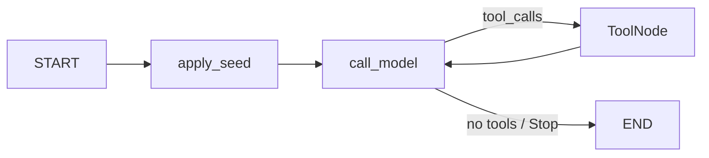

# ADR-011: LangGraph RAG — замена L2 orchestration

## Статус
✅ **Принято** — research subgraph спецификация; orchestration реализован в [ADR-012](012-unified-agent-runtime.md).

> Заменяет **orchestration shell** L2 из [ADR-008](008-agentic-graph-rag.md) и
> **отменяет дальнейшее наращивание** intent-routing слоёв legacy L2
> (`referent router`, resolvers, structured plan, plan alignment).
> **Сохраняет:** каскад L0→L1, tools, indexing, dialog ledger (ADR-009),
> Tier A fast-path. Сценарии — [rag-pipeline/README.md](../rag-pipeline/README.md).

## Контекст

После реализации ADR-008 (L0→L1→L2) и ADR-009 (dialog ledger) L2 вырос
в многослойный pipeline:

```
Brief → Referent router → Target/Artifact resolvers → Plan LLM → Plan alignment
     → Plan exec → Stop evaluator → Reactive fallback
```

**Наблюдаемые проблемы** (production traces + ADR-009):

| Симптом | Пример | Корневая причина |
|---------|--------|------------------|
| Не находит нужное | L1 hit есть, executor не открывает | L1 и L2 disconnected; binding lock |
| Multi-turn ломается | Turn 3 «та картинка» (ADR-009) | Upfront intent classification |
| Multi-evidence ломается | Нужны artifact + note + несколько posts | Mutually exclusive gates; single target lock |
| Много LLM / медленно | 4–11 вызовов до answer model | Resolvers + plan + replan + reactive |
| Непредсказуемо | plan rejected → replan → stop rejected | Planner борется с gate-слоем |
| Сложно развивать | Каждый кейс = новый referent_type + модуль | Архитектура «компилятор intent'ов» |

При этом **инфраструктура retrieval работает**: pgvector L1, graph tools
(`OpenPost`, `HydrateAttachment`, …), dialog ledger, vision budget, indexing.
Ломается **модель orchestration**, а не tools или данные.

**Мотивация LangGraph:** явный typed state, nodes/edges, subgraphs, conditional
routing, checkpointing — mental model, которую проще держать в голове, чем
1600+ строк nested if в `rag_agent.py`. LangGraph — **целевая форма** L2, не
«обёртка ради моды».

## Связь с предыдущими ADR

| ADR | Что остаётся | Что меняется / отменяется |
|-----|--------------|---------------------------|
| **008** | L0, L1, каскад, graph tools, Tier A/B, принцип read-only | L2 planner loop → LangGraph subgraph |
| **009** | PostgreSQL dialog ledger, seed hydrated artifacts, cross-post allow для resolved refs | Artifact resolver, referent router, deterministic dialog plan — **убрать**; ledger → context pack |

ADR-008 **не отменяется** — меняется только реализация L2 и принцип routing
(«agent + rich context» вместо «classify → one branch → fight planner»).

## Рассмотренные варианты

**A. Починить текущий pipeline** — добавить ещё resolvers и referent types под новые классы запросов.

- ❌ Наращивает сложность; каждый класс = новый модуль и gate.
- ❌ Не решает exclusive gates и LLM overhead.

**B. Упростить custom loop** — один ReAct `while` без LangGraph.

- ✅ Минимум зависимостей.
- ❌ Не даёт checkpointing, viz, стандартных паттернов; пользователь явно
  предпочитает LangGraph-модель.

**C. Портировать текущий L2 в LangGraph nodes 1:1**

- ❌ Те же gates/resolvers/plan — тот же pain, другой синтаксис.
- ❌ 8–12 недель на behavioral parity без упрощения.

**D. (выбран) LangGraph + упрощённый ReAct subgraph**

- ✅ LangGraph idioms: StateGraph, ToolNode, conditional edges, subgraph.
- ✅ Compositional by default — несколько tools за один loop, без referent_type.
- ✅ Меньше LLM: 1–4 вызова agent до answer model (Tier A seed без LLM).
- ✅ Dialog ledger в context pack с первого шага agent subgraph.
- ⚠️ Новая зависимость (`langgraph`, `langchain-core`); миграция тестов.

## Решение

### Принцип: thin agent, fat context

L2 — **один ReAct subgraph** LangGraph. Upfront routing (brief, resolvers,
structured plan) **не переносится**. Вместо classification agent получает
**богатый детерминированный context pack** и сам выбирает tools.

```
User query
    │
    ▼
┌─────────────────────────────────────┐
│  Top-level StateGraph (rag_graph)   │
│  L0 gate → L1 retrieve → Tier A     │
│       → [sufficient?] → END         │
│       → context_pack → agent subgraph│
│       → append_ledger → END         │
└─────────────────────────────────────┘
```

### Typed state

```python
class RagGraphState(TypedDict):
    # Input / scope
    user_text: str
    scope: str                          # "global" | "post"
    post_id: str | None
    history: list[dict]

    # L1 (deterministic)
    l1_hits: list[dict]
    l1_sufficient: bool
    tier_a_seed_ref: str | None         # e.g. "note:n1", "attachment:f1"
    tier_a_seed_post_id: str | None

    # Dialog (ADR-009, deterministic load)
    dialog_ledger: list[TurnSnapshot]

    # Agent loop (LangGraph reducers)
    messages: Annotated[list, add_messages]
    context_blocks: Annotated[list[str], operator.add]
    visited: Annotated[set[str], merge_sets]
    vision_used: int
    steps: int

    # Output
    rag_context: str
    cites: list[NoteCite]
    stopped_reason: str
```

`AgentState` из `rag_tools.py` остаётся **runtime executor state** внутри
ToolNode; `RagGraphState` — graph-level schema. Mapping в `tools` node.

### Top-level graph (nodes)

| Node | LLM | Описание |
|------|-----|----------|
| `rag_gate` | ❌ | L0: пропуск non-questions ([ADR-008](008-agentic-graph-rag.md)) |
| `l1_retrieve` | ❌ | Vector search + optional rewrite-on-miss |
| `tier_a_eval` | ❌ | Fast-path signals, seed_ref |
| `tier_b_eval` | optional | Sufficiency check (сохранить как optional node) |
| `context_pack` | ❌ | Сбор prompt: L1 hits preview, ledger, scope, seeds, tier_a hints |
| `agent_subgraph` | ✅ | ReAct loop (см. ниже) |
| `append_ledger` | ❌ | ADR-009: snapshot → PostgreSQL |
| `format_output` | ❌ | `context_blocks` → `rag_context` + cites |

**Conditional edges:**

```python
after_tier_a → "end"           if l1_sufficient and not escalate
after_tier_a → "context_pack"  if escalate (rag_mode agentic/auto + signals)
after_agent  → "append_ledger" if context_blocks non-empty
```

Escalation policy **без изменений** — `rag_mode`, Tier A fast-path, Tier B
([`rag_query.py`](../../../backend/app/services/ai/rag_query.py)).

### Agent subgraph (ReAct)



| Node | Описание |
|------|----------|
| `apply_seed` | Tier A seed: `OpenNote`, `OpenPost`, `HydrateAttachment`; ledger seed ([ADR-009](009-dialog-evidence-ledger.md)) |
| `call_model` | Один LLM call: выбор tool или Stop; system prompt + context pack + tool results |
| `tools` | `ToolNode` над `@tool`-обёртками из `rag_tools.py` |

**Conditional edge `should_continue`:**

```python
if steps >= rag_agent_max_steps:     → END
if last message has tool_calls:      → tools
else:                                → END  # Stop or natural end
```

**Stop policy (упрощённая):** agent может вызвать `Stop`; допускается без
15-rule stop evaluator. Минимальный guard: если вопрос visual и `vision_used=0`
и в context нет image evidence — reject Stop, один retry hint. Сложные правила
из `rag_stop_evaluator.py` **не переносятся** в v1 LangGraph.

### Tools и guards

Tools **без изменений по semantics** ([`rag_tools.py`](../../../backend/app/services/ai/rag_tools.py)):

`SearchNodes`, `OpenPost`, `OpenNote`, `ListPostNotes`, `ListNoteAttachments`,
`HydrateAttachment`, `ListPostComments`, `GetPostAnalytics`, `ListPosts`, `Stop`.

**Binding policy** — **tool-level**, не plan-level:

- `should_block_post_scoped_tool` вызывается **внутри** tool executor.
- **Убрать** `resolved_target_post_id` lock на весь plan.
- Cross-post: разрешать `OpenPost(id)` если `id` уже в `visited` (открыт ранее в этом loop)
  или ref из ledger ([ADR-009](009-dialog-evidence-ledger.md) allowlist).
- Vision budget: `rag_agent_max_vision` в `HydrateAttachment` — без изменений.

### Context pack (замена legacy routing)

Node `context_pack` формирует **user message для agent** без LLM:

```yaml
scope: global | post (post_id=…)
l1_hits:
  - rank, node_type, similarity, preview, post_id, note_id, attachment_refs[]
dialog_ledger:
  - turn, entity_type, ref, summary, vision_summary?
tier_a_seed: attachment:f1 | note:n1 | —
tier_a_hints: [pointer_phrase, manifest_neighbors, answer_type_mismatch, …]
constraints:
  - max_steps: 4
  - max_vision: 2
  - cross_post: allow opened posts + ledger refs only
```

Agent **сам** выбирает tools по context pack — multi-hop и multi-evidence
без upfront classification и без отдельных referent types.

### LLM provider

v1: обёртка `BaseChatModel` над существующим [`llm.py`](../../../backend/app/services/ai/llm.py)
(`complete_chat_completion`, BYOK providers). Не менять provider layer в первой
фазе. Опционально позже — `langchain-openai` для совместимости.

### Зависимости

```
langgraph>=0.2
langchain-core>=0.3
```

`langchain-openai` — только если native wrapper окажется хрупким. Без
langchain-community, без LlamaIndex.

### Конфигурация

```python
# app/core/config.py
rag_l2_engine: Literal["legacy", "langgraph"] = "legacy"  # feature flag
# существующие без изменений:
rag_mode: str = "off"
rag_agent_max_steps: int = 4
rag_agent_max_vision: int = 2
```

Переключение: `RAG_L2_ENGINE=langgraph`. Default `legacy` до прохождения
golden tests.

### Trace / observability

Сохранить фазы `trace_step("7. rag.L2.*")` через LangGraph callbacks или
explicit trace в каждом node. Mapping:

| Legacy phase | LangGraph node |
|--------------|----------------|
| `7. rag.L2.seed` | `apply_seed` |
| `7. rag.L2.step` | `call_model` + `tools` |
| `7. rag.L2.plan_*` | **удалено** |
| `7. rag.L2.resolver_*` | **удалено** |

Опционально: LangSmith (`LANGCHAIN_TRACING_V2`) для dev/staging.

### Checkpointing

v1: **не использовать** LangGraph Postgres checkpointer — dialog ledger (ADR-009)
уже покрывает cross-turn evidence. Checkpointer — v2, если понадобится
human-in-the-loop или pause/resume mid-loop.

## Модули: сохранить / удалить / добавить

| Модуль | Действие |
|--------|----------|
| `rag_query.py` | **Изменить** — вызывать `compile_rag_graph()` вместо `run_agentic_loop` |
| `rag_tools.py` | **Сохранить** + `@tool` decorators |
| `rag_dialog_ledger.py` | **Сохранить** |
| `rag.py`, `rag_gate.py`, `rag_escalation.py`, `rag_sufficiency.py` | **Сохранить** |
| `rag_binding_policy.py` | **Упростить** — tool-level only, убрать plan-level lock |
| `rag_agent.py` | **Deprecated** → удалить после миграции |
| `rag_retrieval_brief.py` | **Deprecated** → удалить |
| `rag_referent_router.py` | **Deprecated** → удалить |
| `rag_target_resolver.py` | **Deprecated** → удалить |
| `rag_artifact_resolver.py` | **Deprecated** → удалить |
| `rag_retrieval_plan.py` | **Deprecated** → удалить |
| `rag_plan_alignment.py` | **Deprecated** → удалить |
| `rag_stop_evaluator.py` | **Deprecated** → минимальный guard в subgraph |
| **`rag_graph.py`** | **Новый** — StateGraph, compile, nodes |
| **`rag_graph_tools.py`** | **Новый** (optional) — `@tool` wrappers |

## План миграции

| Фаза | Scope | Критерий готовности |
|------|-------|---------------------|
| **0** | Golden scenarios: ADR-009 turn 3, примеры 01–07, 13b из [rag-pipeline/README.md](../rag-pipeline/README.md) | Test fixtures + trace snapshots |
| **1** | Agent subgraph only (`apply_seed` → agent ⟷ tools), feature flag | Unit tests subgraph; 4 basic scenarios |
| **2** | Top-level graph (L0→L1→Tier A→subgraph→ledger) | Integration via `retrieve_rag_for_reply` |
| **3** | Tool-level binding refactor; remove target lock | Multi-evidence queries без exclusive gates |
| **4** | Default `rag_l2_engine=langgraph`; delete legacy modules | −~4k LOC; CI green |
| **5** (optional) | LangSmith, checkpointer, graph-aware L1 bundle | Dev ergonomics |

Оценка: **4–6 недель** (1 senior, familiar with codebase).

**Не начинать фазу 4**, пока golden scenarios не зелёные на `langgraph`.

## Тесты (минимум для приёмки v1)

| # | Сценарий | Источник |
|---|----------|----------|
| 1 | L0 skip | Сценарий 1 |
| 2 | L1 sufficient, L2 не запускается | Сценарий 2 |
| 3 | Attachment hydrate chain | Сценарии 3–4 |
| 4 | Vision budget | Сценарий 5 |
| 5 | Dialog turn 3 — ledger artifact | ADR-009, `0671925c` |
| 6 | Multi-hop global: post → note → attachment | Сценарий 4 |
| 7 | Cross-post blocked без allowlist | Regression binding |
| 8 | Budget exhausted | `max_steps` |
| 9 | Ledger append после L2 | ADR-009 persist |
| 10 | Feature flag `legacy` unchanged | No regression during rollout |

Существующие `test_rag_agent.py` → `test_rag_graph.py`; resolver/plan tests
**удалить** после фазы 4.

## Последствия

**Плюсы**

- Mental model совпадает с LangGraph — state, edges, subgraph видны явно.
- Multi-evidence queries без новых referent types и resolvers.
- Меньше LLM-вызовов на типичный L2 turn (1–4 vs 4–11).
- Проще onboarding: ReAct pattern — стандарт, не 8 кастомных модулей.

**Минусы**

- Новые зависимости (`langgraph`, `langchain-core`).
- Кратковременный dual-engine (`legacy` + `langgraph`) — поддержка двух путей.
- Меньше детерминизма на простых fast-path: seed node покрывает Tier A, но
  agent может «лишний» шаг на edge cases.
- Упрощённый stop guard — возможны premature Stop; мониторить в trace.
- ~231 RAG test — часть переписать, часть удалить.

**Риски и митигация**

| Риск | Митигация |
|------|-----------|
| Behavior regression | Golden scenarios + parallel trace compare (фаза 2) |
| LangGraph API churn | Pin versions; thin wrapper `rag_graph.py` |
| Agent hallucinate tool args | Tool-level validation уже в `rag_tools.py` |
| Named post disambiguation без resolver | L1 hits + `SearchNodes` + `ListPosts`; monitor global chat |

## Ссылки

- [ADR-008: Agentic Graph RAG](008-agentic-graph-rag.md) — каскад L0→L2, tools
- [ADR-009: Dialog Evidence Ledger](009-dialog-evidence-ledger.md) — ledger сохраняется
- [Сценарий: Agentic Graph RAG (ADR-011)](../rag-pipeline/README.md)
- [Сценарий: Agentic Graph RAG (legacy, deprecated)](../agentic-rag-scenario.md)
- Код (target): `rag_graph.py`, `rag_query.py` (integration)
- Код (deprecated): `rag_agent.py`, `rag_*_resolver.py`, `rag_retrieval_plan.py`,
  `rag_plan_alignment.py`, `rag_referent_router.py`, `rag_retrieval_brief.py`,
  `rag_stop_evaluator.py`
