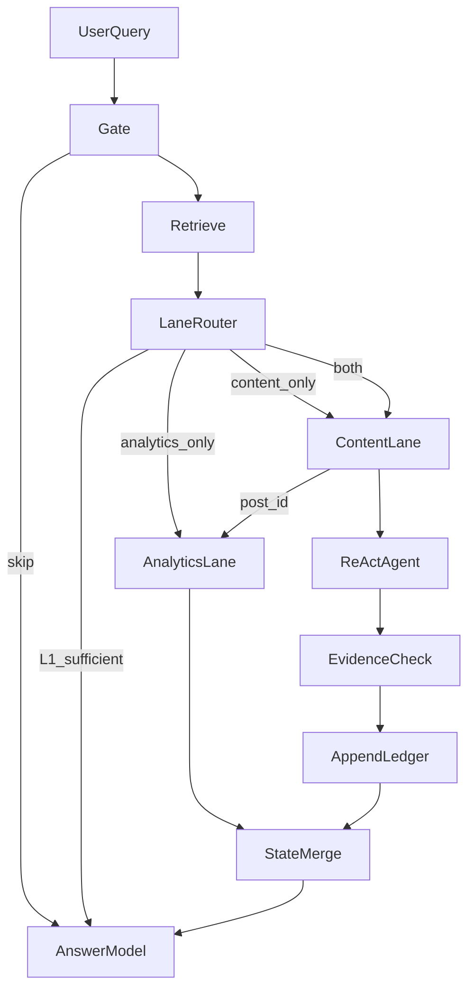

# Каталог примеров RAG-пайплайна (ADR-011)

> **Статус:** эталонное поведение **Unified LangGraph Agent** ([ADR-012](../adr/012-unified-agent-runtime.md)) —
> single WorkspaceAgent, evidence-driven research, HITL actions/media. Детальные pipeline-файлы —
> [examples/](examples/).

Связанные документы: [ADR-011: LangGraph RAG](../adr/011-langgraph-rag.md),
[ADR-008: Agentic Graph RAG](../adr/008-agentic-graph-rag.md),
[ADR-009: Dialog Evidence Ledger](../adr/009-dialog-evidence-ledger.md).

Legacy (deprecated): [agentic-rag-scenario.md](../agentic-rag-scenario.md) —
старая модель L2 с resolvers и plan alignment; сохранён для regression до
миграции.

**Этап 2 (в работе):** детальные pipeline-файлы в [examples/](examples/).

| Статус | Примеры |
|--------|---------|
| Research | [01](examples/01-l0-skip.md), [02](examples/02-l1-sufficient.md), [03](examples/03-pdf-from-note.md), [04](examples/04-multi-hop-post-note-pdf.md), [13](examples/13-dialog-artifact-turn3.md), [16](examples/16-combined-content-analytics.md) |
| Actions / media | [17](examples/17-research-draft-hitl.md), [18](examples/18-image-generation.md), [19](examples/19-video-generation-cancel.md) |
| TBD | 05–12, 13b, 14, 15, 09 |

---

## Модель пайплайна

Каждый пример помечен полями:

| Поле | Значения |
|------|----------|
| **lanes** | `none` / `content` / `analytics` / `both` / `write` |
| **depth** | `L0` / `L1` / `agent` / `multi-turn` / `interrupt` |
| **scope** | `global` / `post` |



**Принципы:**

- Lane router **не** будит обе линии на каждый запрос — только нужные.
- Analytics lane часто получает `post_id` из content lane (combined queries).
- Детерминированные фазы (gate, retrieve, seed, ledger) — без LLM; agent —
  только когда L1 недостаточен.

---

## 1. Общие фикстуры

### Пост `post-1` («Мартовский дайджест», published)

```json
{
  "id": "post-1",
  "text": "Подводим итоги марта! Портфель показал уверенный рост. Подробный разбор — в закреплённой заметке ниже.",
  "media": [{ "name": "chart_march.jpg", "url": "...", "type": "image/jpeg" }],
  "notes": [
    {
      "id": "n1",
      "title": "Итоги Q1",
      "body": "Полные результаты доходности по месяцам. См. [приложенный отчёт](attachment:f1).",
      "files": [{ "id": "f1", "name": "Отчёт_Q1.pdf", "url": "...", "type": "application/pdf" }]
    }
  ],
  "comments": [
    { "id": "c1", "author": "Аня", "text": "Отличный результат!" },
    { "id": "c2", "author": "Игорь", "text": "Почему так мало заработали в марте?" },
    { "id": "c3", "author": "Вика", "text": "А когда следующий разбор?" }
  ]
}
```

> При индексации `attachment:f1` вырезается из текста чанка; id вложения
> сохраняется в метаданных (`referenced_attachment_ids: ["f1"]`). `attachment_text`
> для `f1` в сценариях 03–04 изначально **не** проиндексирован.

### Глобальная заметка `n-global-1`

```json
{ "id": "n-global-1", "title": "Стратегия на 2026", "body": "60% акции, 30% облигации, 10% кэш. Ребалансировка раз в квартал." }
```

### Черновик `draft-ai-1` (для combined content + analytics)

```json
{
  "id": "draft-ai-1",
  "title": "Набросок: ИИ в продукте",
  "body": "Ключевые тезисы про внедрение ИИ-ассистента в редактор постов…",
  "published_post_id": "post-42"
}
```

### Пост `post-42` (опубликован на основе черновика)

```json
{
  "id": "post-42",
  "text": "Как мы внедряем ИИ в редактор — краткий обзор для канала.",
  "status": "published"
}
```

Analytics snapshot для `post-42`: `views: 4500`, `er: 6.8%` (пик за неделю).

### Пост `post-welcome` (id=`3`)

Welcome-пост **без** media — только текст.

### Пост `post-switch` (id=`721`)

Пост «про переключения» с PNG-вложением в заметке (для multi-turn vision).

### Ledger snapshot (после turn 2 в чате multi-turn)

```yaml
turn: 2
entities:
  - entity_type: attachment
    ref: attachment:704a2ddd-…
    post_id: "721"
    vision_summary: "anime-style illustration with female characters"
    hydrated: true
```

---

## 2. Каталог примеров

### 01 — L0: RAG не нужен

- **Запрос:** «Спасибо, отлично!» (global chat)
- **Линии:** none
- **Глубина:** L0
- **Ожидание:** ответ из bundle + истории; retrieval не запускается
- **Ключевой сигнал:** gate skip — нет предметного вопроса
- **Детальный пайплайн:** [examples/01-l0-skip.md](examples/01-l0-skip.md) — TBD

---

### 02 — L1 достаточен

- **Запрос:** «Какая у меня стратегия распределения активов?» (global chat)
- **Линии:** content
- **Глубина:** L1
- **Ожидание:** `rag_context` = чанк «Стратегия на 2026»; agent не запускается
- **Ключевой сигнал:** top hit sim 0.86, ответ в чанке (60/30/10), escalate=false
- **Детальный пайплайн:** [examples/02-l1-sufficient.md](examples/02-l1-sufficient.md) — TBD

---

### 03 — PDF из заметки

- **Запрос:** «Какая точная доходность в отчёте?» (post chat, открыт `post-1`)
- **Линии:** content
- **Глубина:** agent (1–2 steps)
- **Ожидание:** note_chunk + текст PDF в `rag_context`; ответ с цифрами
- **Ключевой сигнал:** known_ref `attachment:f1`, seed `HydrateAttachment` без LLM на seed
- **Детальный пайплайн:** [examples/03-pdf-from-note.md](examples/03-pdf-from-note.md)

---

### 04 — Multi-hop: пост → заметка → вложение

- **Запрос:** «Что мы писали про итоги марта?» (global chat)
- **Линии:** content
- **Глубина:** agent (3–4 steps)
- **Ожидание:** цепочка post_text → note → PDF; итог с цифрами из отчёта
- **Ключевой сигнал:** pointer phrase в post_text; manifest непройденных notes
- **Детальный пайплайн:** [examples/04-multi-hop-post-note-pdf.md](examples/04-multi-hop-post-note-pdf.md)

---

### 05 — Vision по картинке поста

- **Запрос:** «Что изображено на графике в этом посте?» (post chat, `post-1`)
- **Линии:** content
- **Глубина:** agent (1 step)
- **Ожидание:** vision summary `chart_march.jpg` в контексте; описание графика
- **Ключевой сигнал:** answer_type_mismatch (имя файла ≠ визуальное описание)
- **Детальный пайплайн:** [examples/05-vision-chart.md](examples/05-vision-chart.md) — TBD

---

### 06 — Комментарии поста

- **Запрос:** «Какая реакция в комментариях?» (post chat)
- **Линии:** content
- **Глубина:** agent (1 step)
- **Ожидание:** тексты комментариев в `rag_context`
- **Ключевой сигнал:** лексика «комментарии»; `ListPostComments`
- **Детальный пайплайн:** [examples/06-post-comments.md](examples/06-post-comments.md) — TBD

---

### 07 — Кэш: повторный вопрос про PDF

- **Запрос:** тот же, что в 03, после того как `attachment_text` для `f1` закэширован
- **Линии:** content
- **Глубина:** L1
- **Ожидание:** L1 hit на `attachment_text`; agent не нужен
- **Ключевой сигнал:** `attachment_text` в индексе после первого hydrate
- **Детальный пайплайн:** [examples/07-cached-attachment-l1.md](examples/07-cached-attachment-l1.md) — TBD

---

### 08 — Промах: данных нет

- **Запрос:** вопрос по теме, которой нет в индексе (global chat)
- **Линии:** content
- **Глубина:** agent (budget exhausted)
- **Ожидание:** agent исчерпал steps; answer model честно сообщает об отсутствии данных
- **Ключевой сигнал:** empty L1 или низкая similarity на всех hops
- **Детальный пайплайн:** [examples/08-miss-budget-exhausted.md](examples/08-miss-budget-exhausted.md) — TBD

---

### 09 — Write action (будущее)

- **Запрос:** «Опубликуй этот черновик завтра в 10:00»
- **Линии:** write
- **Глубина:** interrupt
- **Ожидание:** prepare action → LangGraph interrupt → user approve → execute
- **Ключевой сигнал:** imperative + write-tool; вне retrieval graph (ADR-008 priority 2)
- **Детальный пайплайн:** [examples/09-write-hitl.md](examples/09-write-hitl.md) — TBD

---

### 10 — Fast-path: пост + заметка

- **Запрос:** «Почему в ленту зашёл пост про розетки?» (global chat)
- **Линии:** content
- **Глубина:** agent (seed)
- **Ожидание:** Tier A seed `note:n…` или `OpenPost`; контекст без длинного цикла
- **Ключевой сигнал:** Tier A fast_path `post_note`
- **Детальный пайплайн:** [examples/10-fast-path-post-note.md](examples/10-fast-path-post-note.md) — TBD

---

### 11 — Cross-post в post chat

- **Запрос:** про чужой пост, пока открыт post chat другого поста
- **Линии:** content
- **Глубина:** agent (2–3 steps)
- **Ожидание:** `OpenPost` целевого поста по L1 hint; не путать с текущим scope
- **Ключевой сигнал:** Tier A `cross_post` hint
- **Детальный пайплайн:** [examples/11-cross-post-post-chat.md](examples/11-cross-post-post-chat.md) — TBD

---

### 12 — Named post без misbind на L1 note

- **Запрос:** «Какое изображение подойдёт моему приветственному посту?» (global chat)
- **Линии:** content
- **Глубина:** agent (2–3 steps)
- **Ожидание:** `SearchNodes` / `ListPosts` → `OpenPost(3)`; не lock на L1 note с чужими PNG
- **Ключевой сигнал:** named post discovery; tool-level binding, без plan-level target lock
- **Детальный пайплайн:** [examples/12-named-post-discovery.md](examples/12-named-post-discovery.md) — TBD

---

### 13 — Dialog artifact (turn 3)

- **Контекст:** turn 1 welcome (post 3), turn 2 vision PNG (post 721) → ledger
- **Запрос:** «А как же картинка с девушками?» (global chat)
- **Линии:** content
- **Глубина:** multi-turn
- **Ожидание:** ledger seed `attachment:704a…`; vision без re-hydrate; `plan_complete`
- **Ключевой сигнал:** deixis + ledger entity match; context pack с ledger с первого шага
- **Детальный пайплайн:** [examples/13-dialog-artifact-turn3.md](examples/13-dialog-artifact-turn3.md)

---

### 13b — Dialog compare (один post)

- **Контекст:** ledger с PNG из turn 2 (сценарий 13)
- **Запрос:** «Подойдёт ли она welcome-посту?» (global chat)
- **Линии:** content
- **Глубина:** multi-turn
- **Ожидание:** seed artifact из ledger + `OpenPost(3)` для текста welcome-поста
- **Ключевой сигнал:** compare cue + deixis «она»; два evidence slots в одном agent loop
- **Детальный пайплайн:** [examples/13b-dialog-compare-one-post.md](examples/13b-dialog-compare-one-post.md) — TBD

---

### 14 — Multi-evidence без referent_type

- **Запрос:** вопрос, требующий artifact из ledger + note + несколько posts (compositional)
- **Линии:** content
- **Глубина:** agent (3–4 steps)
- **Ожидание:** agent открывает note (каталог/список) и несколько `OpenPost`; без exclusive gates
- **Ключевой сигнал:** несколько tools за один loop; cross-post allow для opened posts
- **Детальный пайплайн:** [examples/14-multi-evidence-compositional.md](examples/14-multi-evidence-compositional.md) — TBD

---

### 15 — Analytics only

- **Запрос:** «Какой ER у постов за последний месяц?» (global chat)
- **Линии:** analytics
- **Глубина:** L1 / agent (1 step)
- **Ожидание:** метрики из semantic layer (`GetPostAnalytics` / channel metrics); content lane не нужен
- **Ключевой сигнал:** analytics intent; typed metrics API, не LLM-SQL
- **Детальный пайплайн:** [examples/15-analytics-only.md](examples/15-analytics-only.md) — TBD

---

### 16 — Combined: контент + аналитика

- **Запрос:** «Посмотри, как отработали те наброски про ИИ» (global chat)
- **Линии:** both
- **Глубина:** agent
- **Ожидание:** content находит `draft-ai-1` → `post_id=post-42` → `get_performance_metrics(post-42)` → ответ с текстом и цифрами
- **Ключевой сигнал:** сквозной `post_id` в State; analytics **после** content, не параллельно «вслепую»
- **Детальный пайплайн:** [examples/16-combined-content-analytics.md](examples/16-combined-content-analytics.md)

---

## 3. Сводная таблица

| ID | Запрос (суть) | Линии | Глубина | Agent steps | Ключевой сигнал |
|----|---------------|-------|---------|-------------|-----------------|
| 01 | Реплика без вопроса | none | L0 | 0 | gate skip |
| 02 | Факт в заметке (60/30/10) | content | L1 | 0 | L1 sufficient |
| 03 | Число в PDF-вложении | content | agent | 1–2 | known_ref attachment:f1 |
| 04 | Число в PDF через пост | content | agent | 3–4 | pointer + multi-hop |
| 05 | Содержимое картинки | content | agent | 1 | vision, answer_type_mismatch |
| 06 | Реакция в комментариях | content | agent | 1 | ListPostComments |
| 07 | Повтор после кэша PDF | content | L1 | 0 | attachment_text indexed |
| 08 | Данных нет | content | agent | max | budget exhausted |
| 09 | Команда «опубликуй» | write | interrupt | — | HITL write (TBD) |
| 10 | Почему зашёл пост | content | agent | 0–1 | Tier A post_note seed |
| 11 | Чужой пост в post chat | content | agent | 2–3 | cross_post hint |
| 12 | Named welcome post | content | agent | 2–3 | discovery, no target lock |
| 13 | Dialog artifact turn 3 | content | multi-turn | 0–1 | ledger seed |
| 13b | Dialog compare one post | content | multi-turn | 1–2 | ledger + OpenPost(3) |
| 14 | Compositional multi-evidence | content | agent | 3–4 | multi-tool, no referent_type |
| 15 | ER за месяц | analytics | L1/agent | 0–1 | metrics API only |
| 16 | Наброски про ИИ + метрики | both | agent | 2–3 | content → post_id → metrics |

---

## 4. Порядок детализации (этап 2)

**Готово:** 03, 04, 13, 16.

**Следующие:** 01, 02, 05, 13b, 15 — затем остальные.

Шаблон детального файла:

1. Контекст (scope, history, ledger state)
2. **Последовательность действий** — нумерованная таблица: кто (Система / Агент / Инструмент / Ответная модель), что делает, LLM да/нет, изменение State
3. State slots до/после (краткий yaml)
4. Чего не происходит (контраст с legacy)
5. Acceptance criteria для теста
