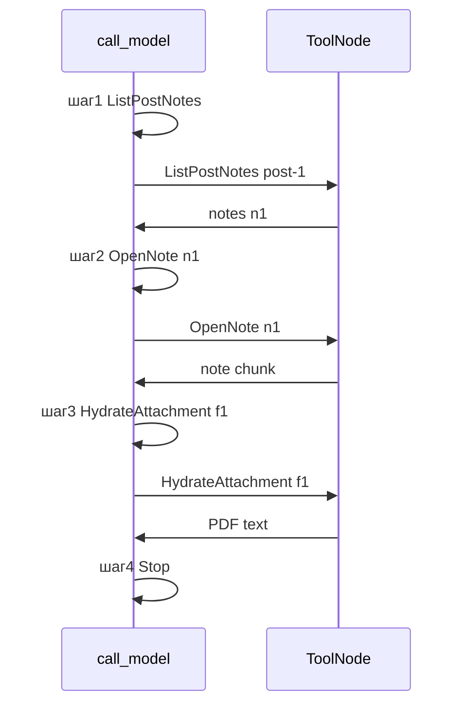

# Пример 04 — Multi-hop: пост → заметка → вложение

← [Каталог](../README.md#04--multi-hop-пост--заметка--вложение)

**ADR-011:** content lane, ReAct agent, цепочка tools без structured plan.

**Условные обозначения:** см. [пример 03](03-pdf-from-note.md#2-последовательность-действий) (Система / Агент / Инструмент / Ответная модель).

---

## 1. Контекст

| Поле | Значение |
|------|----------|
| **Запрос** | «Что мы писали про итоги марта?» |
| **Scope** | `global` |
| **Линии** | content |
| **История** | нет |
| **Ledger** | пустой |
| **Фикстуры** | [post-1](../README.md#пост-post-1-мартовский-дайджест-published) |

**Предусловия:** `post_text` post-1 в индексе; `attachment_text` для `f1` уже в кэше (после примера 03).

---

## 2. Последовательность действий

| # | Кто | Действие | LLM | Изменение в State |
|---|-----|----------|-----|-----------------|
| 1 | **Система** | Принять запрос, scope `global` | нет | `user_text`, `scope=global` |
| 2 | **Система** | `rag_gate`: предметный вопрос → pass | нет | `gate_passed=true` |
| 3 | **Система** | `l1_retrieve`: vector search | нет | `l1_hits[0]` = post_text post-1, sim 0.83 |
| 4 | **Система** | `need_agent` (Tier A): `pointer_phrase=true` («в закреплённой заметке»), manifest: note `n1` не открыта | нет | `need_agent=true`, hints: pointer, manifest |
| 5 | **Система** | `lane_router` → `lanes=[content]` | нет | content only |
| 6 | **Система** | `context_pack`: L1 hit post-1 + pointer hint + manifest neighbors | нет | `context_pack` |
| 7 | **Система** | `load_ledger` | нет | `dialog_ledger=[]` |
| 8 | **Система** | `apply_seed`: known_ref нет на post_text → seed пропускается | нет | — |
| 9 | **Агент** | `call_model` (шаг 1): выбрать tool `ListPostNotes(post_id=post-1)` | **да** | tool_call в messages |
| 10 | **Инструмент** | `ListPostNotes`: прочитать `notes[]` из JSONB post-1 | нет | transcript += список notes; manifest подтверждён |
| 11 | **Агент** | `call_model` (шаг 2): выбрать tool `OpenNote(note_id=n1, post_id=post-1)` | **да** | tool_call |
| 12 | **Инструмент** | `OpenNote`: загрузить note n1, добавить chunk в context | нет | `context_blocks` += note text; `visited` += n1; pointer на f1 виден |
| 13 | **Агент** | `call_model` (шаг 3): выбрать tool `HydrateAttachment(ref=attachment:f1, mode=text)` | **да** | tool_call |
| 14 | **Инструмент** | `HydrateAttachment`: cache hit (f1 уже в attachment_text) → текст PDF в context | нет | `context_blocks` += PDF; `visited` += f1 |
| 15 | **Агент** | `call_model` (шаг 4): выбрать tool `Stop(reason=sufficient)` | **да** | Stop |
| 16 | **Система** | `should_continue` → END subgraph (`steps=4`) | нет | `stopped_reason=sufficient` |
| 17 | **Система** | `evidence_check`: post + note + attachment в context → pass | нет | — |
| 18 | **Система** | `append_ledger`: snapshot post-1, n1, f1 | нет | ledger записан |
| 19 | **Система** | `format_output` → `rag_context` | нет | context готов |
| 20 | **Ответная модель** | Ответ с фактами из цепочки post → note → PDF | **да** | ответ пользователю |

**Итого LLM:** 4 agent + 1 answer = **5**.  
**Agent budget:** 4 из 4 (лимит исчерпан, но Stop принят).

---

## 3. Цикл агента (шаги 9–15)



---

## 4. State после действия 16

```yaml
context_blocks:
  - "[post post-1] Подводим итоги марта! … в закреплённой заметке ниже."
  - "[note n1] Полные результаты доходности…"
  - "[attachment f1] …текст PDF…"
visited: [post:post-1, note:n1, attachment:f1]
steps: 4
stopped_reason: sufficient
```

---

## 5. Чего не происходит

- Нет structured plan / replan / plan_alignment
- Нет `resolved_target_post_id` lock
- `ListPostNotes` не требует отдельного L1 hit на note
- Analytics lane не активируется

---

## 6. Acceptance criteria

1. Ровно 4 agent steps: ListPostNotes → OpenNote → HydrateAttachment → Stop.
2. Каждый tool вызывается **агентом**, кроме seed (пропущен).
3. Ответ опирается на открытый PDF, не на hallucination.
