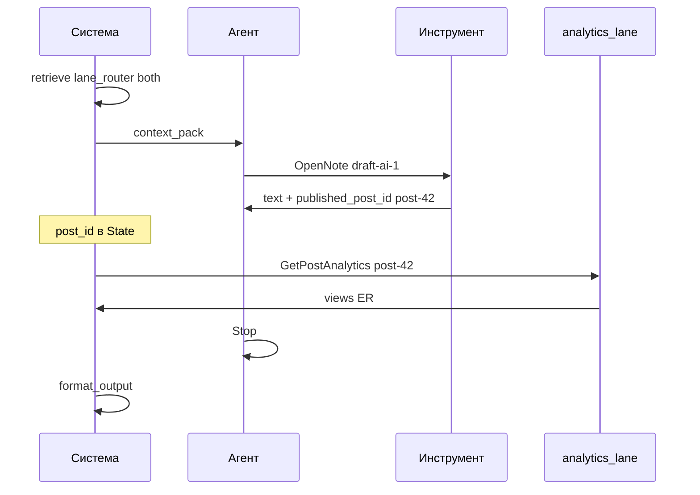

# Пример 16 — Combined: контент + аналитика

← [Каталог](../README.md#16--combined-контент--аналитика)

**ADR-011:** dual-lane — content lane **сначала**, analytics lane **после** `post_id` в State.

**Условные обозначения:** см. [пример 03](03-pdf-from-note.md).

---

## 1. Контекст

| Поле | Значение |
|------|----------|
| **Запрос** | «Посмотри, как отработали те наброски про ИИ» |
| **Scope** | `global` |
| **Линии** | **both** (последовательно: content → analytics) |
| **История** | нет |
| **Ledger** | пустой |

**Фикстуры:** draft-ai-1 (`published_post_id: post-42`), post-42 metrics: views 4500, ER 6.8%.

---

## 2. Последовательность действий

### Фаза A — общий вход

| # | Кто | Действие | LLM | Изменение в State |
|---|-----|----------|-----|-----------------|
| 1 | **Система** | Принять запрос, scope `global` | нет | `user_text` |
| 2 | **Система** | `rag_gate`: pass | нет | `gate_passed=true` |
| 3 | **Система** | `l1_retrieve`: hit note_chunk / draft «Набросок: ИИ в продукте», sim ~0.85 | нет | `l1_hits` |
| 4 | **Система** | `need_agent`: cue «отработали» → нужны и текст, и метрики → escalate | нет | `need_agent=true` |
| 5 | **Система** | `lane_router`: **both**, порядок `content` затем `analytics` | нет | `lanes=[content, analytics]`, `lanes_pending=[content, analytics]` |
| 6 | **Система** | `load_ledger` | нет | `dialog_ledger=[]` |
| 7 | **Система** | `context_pack`: L1 hits + hint «performance/metrics likely» | нет | `context_pack` |

### Фаза B — content lane (agent subgraph)

| # | Кто | Действие | LLM | Изменение в State |
|---|-----|----------|-----|-----------------|
| 8 | **Система** | `apply_seed`: нет known_ref → skip | нет | — |
| 9 | **Агент** | `call_model` (шаг 1): выбрать `OpenNote(note_id=draft-ai-1)` или контент уже в L1 hit | **да** | tool_call |
| 10 | **Инструмент** | `OpenNote`: прочитать body черновика + metadata `published_post_id: post-42` | нет | `context_blocks` += draft text; `visited` += draft-ai-1 |
| 11 | **Агент** | `call_model` (шаг 2): прочитать metadata → записать `post_id=post-42` в State; выбрать промежуточный tool или перейти к analytics handoff | **да** | `resolved_post_ids=[post-42]`; `lanes_completed` += content |
| 12 | **Система** | **Условие:** `post_id` в State → разрешить analytics lane | нет | `analytics_allowed=true` |

> Analytics lane **не** стартовал на шаге 5 параллельно — ждёт `post_id`.

### Фаза C — analytics lane (deterministic)

| # | Кто | Действие | LLM | Изменение в State |
|---|-----|----------|-----|-----------------|
| 13 | **Система** | `analytics_lane`: вызвать typed tool `GetPostAnalytics(post_id=post-42, period=7d)` — внутри фиксированный SQL, не LLM | нет | `metrics.post-42 = {views: 4500, er: 6.8}` |
| 14 | **Система** | Добавить metrics block в `context_blocks` | нет | `context_blocks` += "[analytics post-42] views=4500, er=6.8%" |
| 15 | **Система** | `lanes_completed` += analytics | нет | обе линии закрыты |

### Фаза D — завершение

| # | Кто | Действие | LLM | Изменение в State |
|---|-----|----------|-----|-----------------|
| 16 | **Агент** | `call_model` (шаг 3): `Stop(sufficient)` — draft + metrics в context | **да** | Stop |
| 17 | **Система** | `evidence_check`: текст черновика + metrics → pass | нет | — |
| 18 | **Система** | `append_ledger`: snapshot draft + post-42 | нет | ledger |
| 19 | **Система** | `state_merge` + `format_output` → `rag_context` | нет | merged context |
| 20 | **Ответная модель** | Ответ: «набросок про ИИ… опубликован как post-42… 4500 просмотров, ER 6.8%» | **да** | ответ пользователю |

**Итого LLM:** 3 agent + 1 answer = **4**.  
**Analytics:** 0 LLM (typed tool only).

---

## 3. Диаграмма dual-lane (последовательность, не параллель)



---

## 4. State после действия 15

```yaml
context_blocks:
  - "[draft draft-ai-1] Ключевые тезисы про внедрение ИИ-ассистента…"
  - "[analytics post-42] views=4500, er=6.8%, period=7d"
resolved_post_ids: [post-42]
metrics:
  post-42: {views: 4500, er: 6.8}
lanes_completed: [content, analytics]
steps: 3
```

---

## 5. Чего не происходит

| Anti-pattern | ADR-011 |
|--------------|---------|
| Analytics и content стартуют одновременно на шаге 5 | Analytics ждёт `post_id` (шаг 12) |
| LLM пишет SQL | `GetPostAnalytics` typed tool |
| Параллельные «два агента» | один ReAct agent + один deterministic analytics node |
| Ответ с цифрами из history | цифры только из действия 13 |

---

## 6. Acceptance criteria

1. Действие 13 только после `resolved_post_ids` содержит post-42.
2. Metrics в ответе совпадают с tool output.
3. `lane_router` = both, но analytics **после** content handoff.
