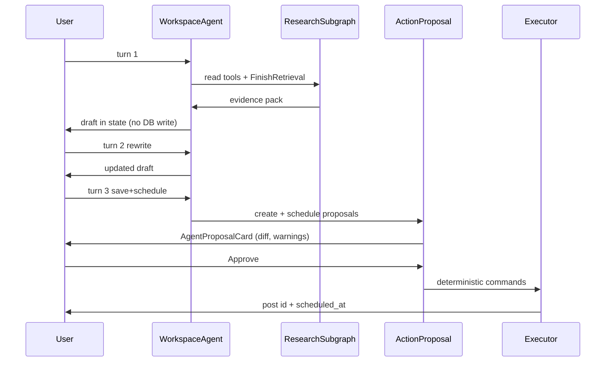

# 17 — Research → draft → schedule (HITL)

| Поле | Значение |
|------|----------|
| **lanes** | `content` + `write` |
| **depth** | `agent` + `interrupt` |
| **scope** | `post` |

## Запросы

1. «Собери факты из заметок к этому посту и предложи черновик»
2. «Перепиши короче» *(без HITL — transient `PostDraftArtifact`)*
3. «Сохрани как черновик и запланируй на завтра 10:00»

## Ожидаемый pipeline

## Acceptance

- [ ] Turn 1–2: zero post mutations in DB
- [ ] Turn 3: `action_proposals` с payload hash; approve идемпотентен
- [ ] Reject → agent продолжает диалог
- [ ] Concurrent edit → `resource_version` conflict
- [ ] Audit event на approve/apply
