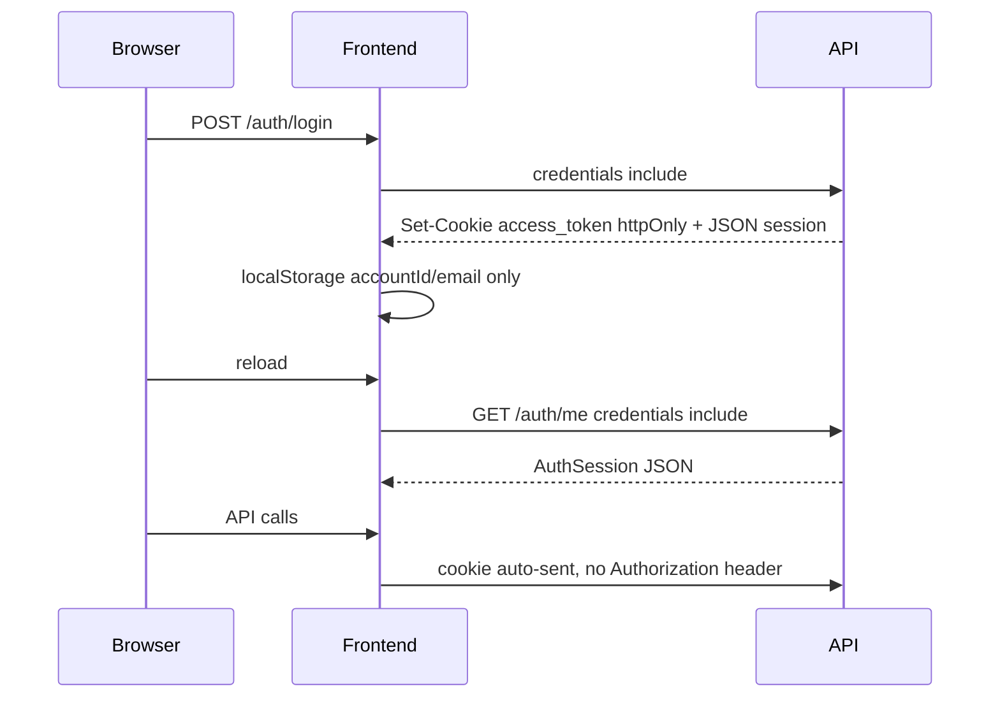

# Cookie-аутентификация (httpOnly JWT)

Реальные пользователи (логин, регистрация, `demo@mail.ru`) получают JWT в **httpOnly cookie** `access_token`. JavaScript не может прочитать токен — защита от XSS.

Анонимный presentation-режим (`guest:<uuid>`, `presentation:guest`) **не использует cookie**: токен генерируется на клиенте и передаётся через `Authorization: Bearer` (нет секретов, не требует round-trip к серверу).

## Поток



## Переменные окружения (backend)

| Переменная | По умолчанию | Назначение |
|------------|--------------|------------|
| `JWT_COOKIE_NAME` | `access_token` | Имя cookie |
| `COOKIE_SECURE` | `0` | `1` — только HTTPS |
| `COOKIE_SAMESITE` | `lax` | `lax` / `strict` / `none` |
| `COOKIE_DOMAIN` | пусто | Общий домен для фронта и API (напр. `.example.com`) |

## Топологии

### localhost / Docker (один хост, разные порты)

```
CORS_ORIGINS=http://localhost:3000
COOKIE_SECURE=0
COOKIE_SAMESITE=lax
COOKIE_DOMAIN=
```

Фронтенд: `NEXT_PUBLIC_USE_MSW=0`, `NEXT_PUBLIC_API_BASE_URL=http://localhost:8000`.  
Все запросы идут с `credentials: "include"` (см. `frontend/src/shared/api/httpClient.ts`).

### Production: фронт и API на разных поддоменах

```
CORS_ORIGINS=https://app.example.com
COOKIE_SECURE=1
COOKIE_SAMESITE=none
COOKIE_DOMAIN=.example.com
```

Требуется HTTPS на обоих сервисах. CORS на бэкенде уже включает `allow_credentials=True` (`backend/app/main.py`).

## API

| Метод | Путь | Cookie |
|-------|------|--------|
| `POST` | `/api/v1/auth/login/` | устанавливает |
| `POST` | `/api/v1/auth/register/verify/` | устанавливает |
| `POST` | `/api/v1/auth/logout/` | удаляет |
| `GET` | `/api/v1/auth/me/` | читает |

JSON `AuthSession` больше **не содержит** `token` для реального API. Поля: `accountId`, `email`, `createdAt`.

`Authorization: Bearer` по-прежнему поддерживается для гостевых токенов, тестов и скриптов.

## Проверка вручную

1. Войти под реальным пользователем.
2. DevTools → Application → Cookies → `access_token` с флагом HttpOnly.
3. `localStorage` не содержит JWT (только метаданные сессии).
4. Обновить страницу — сессия восстанавливается через `GET /auth/me/`.
5. Logout — cookie исчезает.
6. Presentation mode без логина — работает как раньше (`guest:<uuid>` в localStorage).
