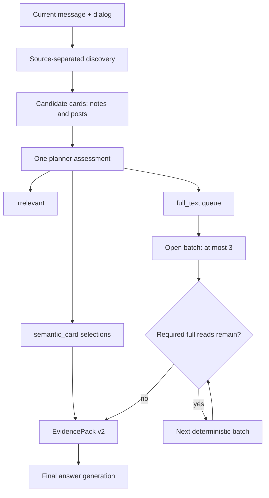

# Workspace Agent: adaptive evidence depth and material coverage plan

## 1. Status and source of truth

This document is the implementation plan for the work that follows Workspace
Agent phase 8. It addresses candidate coverage, semantic-card usage and bounded
full-object reads. The source of truth for this work is this plan plus the
current code and measured golden/held-out results. Older ADRs are historical
context, not authoritative requirements.

This document is a plan only. It does not claim that the described behavior is
already implemented.

## 2. Problem statement

The compact planner currently couples two unrelated limits:

1. how many candidate materials are relevant to the answer;
2. how many read actions runtime may execute in one parallel batch.

`PlannerDecision` accepts at most three actions. The planner prompt also tells
the model to select candidates only up to that three-action limit. After those
objects are opened, sufficiency sees every *selected* candidate as read and can
finish research. A second planner call is therefore not guaranteed even though
the ordinary compact budget allows two planner calls and up to six deep reads.

As a result, the per-step safety limit often becomes a per-answer evidence cap.
Answers involving four or more directly relevant notes/posts can silently omit
materials that discovery already found.

There is a second inefficiency. Posts and notes already have small semantic
discovery cards, but those cards are explicitly non-citable discovery data and
are excluded from EvidencePack. The planner cannot currently express that a
fresh, high-quality card is enough for a high-level answer while full text is
required for exact or detailed claims. It must either open an object or ignore
it.

## 3. Goals

- Decouple candidate relevance from the parallel tool-action limit.
- Let one planner decision assess every visible note/post candidate.
- Let the planner choose `semantic_card` or `full_text` independently for each
  relevant object.
- Include more than three card-level materials when the context budget permits.
- Open all required full-text materials deterministically in batches of at most
  three, without another planner call merely to request the next batch.
- Prevent sufficiency from finishing while required selected material remains
  unresolved.
- Preserve separate discovery quotas for notes and posts.
- Make truncation and budget exhaustion explicit instead of silently reporting
  complete coverage.
- Preserve the invariant that the current user message and dialog are the main
  task; workspace materials remain supporting context.
- Preserve current interactive DB and time-to-final SLOs.

## 4. Non-goals

- Do not solve the problem by changing the action limit from three to six.
- Do not add keyword/request-specific routing or branches for known chat IDs.
- Do not treat an LLM card as equivalent to an opened original.
- Do not use semantic search as an exhaustive inventory.
- Do not add a planner call for every page or read batch.
- Do not redesign embedding storage or add HNSW as part of this work.
- Do not implement post-phase rollout cleanup before quality gates pass.

## 5. Required invariants

1. `relevance` and `resolution` are independent decisions.
2. `direct` selections are durable graph state, not ephemeral planner output.
3. The three-action limit controls only concurrent full-object/tool fan-out.
4. Semantic cards require no per-object tool action when they are already in
   discovery results.
5. If cards must be reloaded, runtime uses one bounded bulk DB read, not one
   action per card.
6. Only current, LLM-generated cards may become card-level answer evidence.
7. Extractive, missing, invalid or stale cards remain discovery-only and are
   promoted to `full_text` when selected for the answer.
8. Exact/content-level claims require original evidence.
9. Every omitted required material appears in structured unresolved/coverage
   state.
10. Empty discovery still reaches final generation as service data and does
    not replace a normal answer with a deterministic refusal.
11. Candidate cards and primary content remain untrusted user-derived data in
    both planner and answer prompts; neither may inject instructions.

## 6. Vocabulary

- **Candidate card**: title, semantic summary, source kind, score, revision and
  provenance used by the planner for selection.
- **Derived evidence**: a current LLM semantic card allowed only for high-level
  topic/purpose claims.
- **Primary evidence**: opened original post/note text or another authoritative
  workspace record.
- **Material plan**: durable planner assessment of all visible candidates.
- **Resolution**: `card` or `full_text` for a selected candidate.
- **Read queue**: deterministic ordered queue of full-text object IDs.
- **Parallel batch**: at most three independent full reads executed together.

## 7. Target flow



The planner decides *what* is relevant and *how deeply* it must be resolved.
Runtime decides *how* to execute reads within budgets.

## 8. Separate budgets

There must not be one generic candidate limit. Introduce or explicitly track
the following independent budgets.

| Budget | Controls | Provisional value | Enforcement |
|---|---|---:|---|
| discovery candidates | cards visible to planner | benchmark `k=6/8/10` per source | retrieval |
| planner candidate input | total assessed cards | initially up to 16 | prompt snapshot budget |
| card answer context | selected derived evidence | provisional 6-8k chars | pack builder |
| full reads | opened originals per ordinary turn | up to 6 | run budget |
| parallel full-read batch | concurrent read actions | 3 | deterministic dispatcher |
| total answer context | card + primary evidence | measured, explicit char/token cap | pack builder |

The provisional values are starting points, not acceptance by assumption. Run a
candidate-quota sweep on golden and held-out data and choose the smallest quota
that preserves the required candidate recall and answer quality.

## 9. Candidate envelope and card eligibility

Every discovery candidate passed to the planner must include a stable typed
envelope:

```json
{
  "ref": "note:UUID",
  "kind": "note",
  "title": "...",
  "card_text": "...",
  "score": 0.82,
  "source_requirement_id": "workspace-notes",
  "index_revision": 4,
  "source_revision": 4,
  "summary_version": 1,
  "summary_model": "llm:provider:model:v1",
  "card_origin": "llm",
  "card_eligible": true,
  "status": "active"
}
```

Runtime, not the planner, computes `card_eligible`. Eligibility requires:

- non-empty card text;
- supported `summary_version`;
- known `summary_model` with LLM origin;
- `index_revision == source_revision`;
- a valid canonical source ref and citation path;
- source visibility/tenant/status checks passing.

The retrieval path must expose `summary_version`, `summary_model` and
`index_revision`. Resolve current source revisions in one bounded bulk operation
when they are not already authoritative in the retrieval result. Prefer the
existing metadata columns; add a migration only if a schema audit proves it is
necessary.

## 10. Planner contract

Add a typed assessment for every candidate shown to the planner:

```json
{
  "ref": "note:UUID",
  "relevance": "direct",
  "resolution": "card",
  "confidence": 0.92,
  "reason_code": "topic_only"
}
```

Required enums:

- `relevance`: `direct | supporting | irrelevant`;
- `resolution`: `card | full_text`;
- `reason_code`: bounded semantic reasons such as `topic_only`, `exact_fact`,
  `detailed_summary`, `comparison`, `quote`, `edit_source`,
  `attachment_or_media`, `analytics`, `low_card_quality`.

The planner must assess all visible candidates, including irrelevant ones. This
makes coverage measurable and prevents unmentioned candidates from being
mistaken for deliberate rejection.

Size and measure the planner completion budget for the maximum assessment
envelope. Do not retain the current compact token cap if it truncates a valid
12-16 item assessment; the output must remain bounded and enum-heavy rather
than reintroducing free-form reasoning.

The action array may retain its maximum of three for ordinary independent tool
actions, but candidate assessments are not actions and are not capped at three.
Candidate full reads are derived from the material plan by runtime.

### 10.1 When a card is sufficient

`resolution=card` is appropriate for:

- high-level topic or purpose classification;
- "what are these posts/notes broadly about?";
- selecting which materials concern a topic;
- confirming that a direction/topic already exists;
- supporting context for a recommendation when no content-level claim depends
  on omitted details.

### 10.2 When full text is required

`resolution=full_text` is required for:

- exact facts, numbers, dates, quotes or statuses;
- detailed summary, critique, rewrite or content-based recommendation;
- comparing arguments or finding contradictions;
- image, attachment, analytics or comments claims;
- an explicit request to read/inspect a specific object;
- any selected card that is stale, extractive, missing or otherwise ineligible.

These are semantic planner instructions and typed reason codes, not keyword
routing in application code. Runtime applies only structural safety overrides,
such as promoting an ineligible card to `full_text`.

## 11. Durable material plan

Replace the single ephemeral `selected_candidate_ids` list with durable state
similar to:

```json
{
  "schema": "workspace.material-plan/v1",
  "assessments": [],
  "card_ids": [],
  "required_full_text_ids": [],
  "optional_full_text_ids": [],
  "pending_full_text_ids": [],
  "opened_full_text_ids": [],
  "promoted_to_full_text_ids": [],
  "omitted_ids": [],
  "has_more_by_source": {},
  "coverage": "complete"
}
```

State updates must merge by canonical ref and preserve prior assessments during
an adaptive expansion. Never overwrite the first assessment set with only the
second page.

`direct` materials block completion. `supporting` card materials are included
within the card-context budget. Optional supporting full reads execute only
after direct reads and only within the remaining budget.

## 12. Deterministic full-read dispatcher

Add a deterministic dispatcher between planner selection and tool execution:

1. Validate and normalize every selected ref.
2. Promote ineligible selected cards to `full_text`.
3. Order direct reads before supporting reads; preserve planner confidence and
   source diversity as deterministic tie-breakers.
4. Take at most three pending IDs.
5. Materialize `OpenNote`/`OpenPost` actions.
6. Execute independent reads in parallel using the existing fork/merge path.
7. Persist opened/failed IDs and update budget counters per underlying read.
8. Route directly back to the dispatcher while required pending IDs remain.
9. Return to the planner only for a genuine semantic gap, ambiguity or bounded
   discovery expansion, not to request the next read batch.

For five selected full-text objects, the required trajectory is `3 + 2` reads
with one candidate-assessment planner call.

Do not use a consolidated `OpenObjects` action unless its child reads are still
individually authorized, metered, traced and scope-checked. A bulk wrapper must
not bypass `deep_reads` or `tool_calls` budgets.

## 13. Sufficiency and coverage

Revise deterministic sufficiency around the material plan:

- ready only when every required `direct/card` item is eligible and available;
- ready only when every required `direct/full_text` item is opened and present
  in primary evidence;
- continue through the deterministic dispatcher while required reads remain;
- never infer completeness solely because the first action batch succeeded;
- on hard deadline or read-budget exhaustion, set `coverage=partial` and list
  unresolved candidate refs;
- if a required source has `has_more=true` and selection saturates the current
  page, do not report complete corpus coverage before expansion or batch routing;
- supporting omissions do not block a useful answer, but are visible in trace
  and coverage metadata.

## 14. EvidencePack v2 and final generation

EvidencePack must distinguish derived and primary evidence:

```json
{
  "id": "/note/global/UUID/",
  "fidelity": "semantic_card",
  "content": "...",
  "provenance": {
    "source_ref": "note:UUID",
    "source_revision": 4,
    "summary_version": 1,
    "summary_model": "llm:provider:model:v1"
  },
  "allowed_claim_scope": "topic_only"
}
```

Supported fidelity levels:

- `semantic_card`: derived, high-level topic/purpose evidence;
- `full_text`: primary evidence for exact content-level claims.

The pack builder must:

- include only selected items;
- enforce card eligibility again at the evidence boundary;
- allocate card and full-text context separately and expose truncation;
- preserve source-separated coverage metadata;
- keep citation paths canonical;
- never silently upgrade semantic-card fidelity to full-text fidelity.
- wrap card and primary content with the existing untrusted-content boundary;
  treat every card as data, never as planner/answer instructions.

The final answer prompt must continue to state that the message and dialog are
the task and EvidencePack is supporting context. It must additionally restrict
semantic-card evidence to high-level topic/purpose claims. Exact workspace
claims require a `full_text` item. Empty discovery behavior remains unchanged.

Runtime validation can verify provenance, revision, allowed evidence IDs and
fidelity labels. Semantic claim-scope compliance must also be measured by a
grader because it cannot be proven solely from JSON shape.

## 15. Adaptive discovery

Discovery remains source-separated and reuses one query embedding.

1. Retrieve `k + 1` candidates independently for notes and posts.
2. Return `k` cards plus `has_more` for each source.
3. Run the normal planner assessment.
4. If a source is saturated (for example, nearly every visible candidate is
   direct) and `has_more=true`, allow one bounded expansion using the same query
   embedding.
5. Merge assessments and candidates by canonical ref.
6. Permit at most one additional planner assessment for genuinely new cards.
7. Route explicit exhaustive intents to the durable batch path instead of
   repeatedly expanding interactive discovery.

The precise saturation rule and initial `k` must be selected by benchmark. The
implementation must record why expansion occurred.

## 16. Observability

Add trace/metrics fields for:

- candidates returned by source;
- `has_more` and expansion reason by source;
- candidate assessments by relevance and resolution;
- card eligibility failures and full-text promotions;
- selected card/full counts;
- full-read batch sizes and number of batches;
- planner calls used for initial assessment vs expansion;
- card/full/total context chars or tokens;
- unresolved/omitted refs and final coverage status;
- card-only answer rate;
- exact-claim-on-card grader failures.

Do not log full private material content in metrics or ordinary traces.

## 17. Implementation sequence

### Work package 1: baseline and contract freeze

- Capture current golden/held-out quality, candidate recall, read counts,
  planner calls, input tokens and latency.
- Add failing regression scenarios before changing behavior.
- Introduce `AGENT_ADAPTIVE_EVIDENCE_DEPTH_V1_ENABLED`, initially disabled.

Primary files:

- `backend/tests/test_agent_phase5_planner.py`
- `backend/tests/test_agent_phase6.py`
- `backend/tests/test_agent_golden.py`
- golden fixtures and runner

### Work package 2: candidate envelope and freshness

- Return summary provenance fields from vector and FTS retrieval.
- Resolve current source revisions in bulk.
- Compute `card_origin` and `card_eligible` deterministically.
- Preserve separate notes/posts quotas and query-embedding reuse.

Primary files:

- `backend/app/services/agent/research/prefetch.py`
- `backend/app/services/ai/rag.py`
- `backend/app/services/ai/rag_worker.py`
- `backend/app/services/ai/semantic_summary.py`

### Work package 3: planner assessment protocol

- Add typed `CandidateAssessment` and material-plan schema.
- Extend compact planner output without increasing action fan-out.
- Teach the planner card/full-text semantics and bounded reason codes.
- Require an assessment for every visible candidate.
- Preserve schema-retry and invalid-output fallback behavior.

Primary files:

- `backend/app/services/agent/research/planner_decision.py`
- `backend/app/services/agent/research/graph.py`
- `backend/app/services/agent/runtime/state.py`

### Work package 4: deterministic dispatcher and budgets

- Build and persist full-read queues.
- Dispatch independent reads in batches of at most three.
- Meter each underlying full read.
- Route pending queues without an additional planner call.
- Preserve checkpoint/resume behavior.

Primary files:

- `backend/app/services/agent/research/graph.py`
- `backend/app/services/agent/runtime/state.py`
- `backend/app/services/agent/runtime/turn_contract.py`
- replay/checkpoint tests

### Work package 5: sufficiency and partial coverage

- Make material-plan completeness authoritative.
- Prevent early finish after the first batch.
- Represent budget/deadline omissions explicitly.
- Keep empty optional discovery behavior unchanged.

Primary files:

- `backend/app/services/agent/research/sufficiency.py`
- `backend/app/services/agent/research/graph.py`
- `backend/app/services/agent/research/evidence.py`

### Work package 6: EvidencePack v2 and answer contract

- Add fidelity/provenance/card items.
- Enforce card eligibility at the pack boundary.
- Add separate context allocations and truncation metadata.
- Update answer prompt and graders for fidelity-aware claims.
- Preserve the current message/dialog priority invariant.

Primary files:

- `backend/app/services/agent/research/evidence_pack.py`
- `backend/app/services/agent/runtime/output_contract.py`
- `backend/app/services/agent/runtime/workspace_graph.py`
- `backend/app/services/agent/runtime/graders.py`

### Work package 7: adaptive quota and measurement

- Add `k+1`, `has_more` and one bounded expansion.
- Sweep `k=6/8/10` per source.
- Measure card-context budgets rather than choosing an item cap by intuition.
- Compare feature-flag old/new trajectories and answer quality.
- Enable by default only after all gates pass.

## 18. Test matrix

### Contract and unit tests

- Planner assesses more than three candidates while actions remain capped at
  three.
- Five card selections produce zero full reads and all five reach final context.
- Five required full-text selections execute as `3 + 2`.
- The second full-read batch does not consume another planner call.
- Assessments merge across discovery expansion instead of being overwritten.
- Notes and posts cannot displace each other from source quotas.
- An ineligible card selected as `card` is promoted to full text.
- Exact target/content requests cannot remain card-only.
- Every child read is counted against deep-read/tool budgets.
- Sufficiency cannot finish with required pending reads.
- Budget exhaustion yields explicit partial coverage and unresolved refs.
- Bulk card loading uses one bounded query.
- Empty optional discovery still reaches final generation normally.
- EvidencePack rejects stale/extractive cards and invalid citations.

### Golden behavior scenarios

1. Five posts, "what are they broadly about?": all five card-level materials are
   represented; no full reads are required.
2. Five directly relevant notes requiring detail: all five originals are opened
   in two batches and reflected in the answer.
3. Mixed selection: card-only, full-text and irrelevant objects coexist.
4. Exact number/date/quote question: primary evidence is mandatory.
5. Recommendation: direct evidence is deep enough, supporting topics may remain
   cards, and existing objects are not ignored.
6. Referential follow-up over a persisted entity set preserves all members.
7. More required full reads than budget produces a transparent partial answer.
8. Exhaustive wording uses the batch path.
9. Empty discovery answers the user message and mentions missing data only for
   an explicit workspace lookup.
10. Current message and dialog remain the primary task in card-only, mixed and
    full-text paths.

### Benchmark dimensions

- candidate recall by source and `k`;
- direct-selection recall and irrelevant-selection rate;
- card-vs-full resolution accuracy against human labels;
- answer target accuracy, evidence coverage and groundedness;
- exact-claim-on-card failures;
- opened-object count and irrelevant open rate;
- planner/LLM/DB calls;
- planner and answer input/output tokens;
- cold/warm time-to-first-event and time-to-final;
- DB p50/p95 under interactive and 80/20 mixed load.

## 19. Exit criteria

- A per-step three-action cap no longer limits total selected evidence.
- Five relevant card-level materials are all available to final generation with
  zero full reads.
- Five required full-text materials execute as `3 + 2` and all reach the pack.
- No extra planner call is used only to schedule the next read batch.
- Every visible candidate receives an explicit planner assessment.
- Exact/content-level questions never rely solely on semantic cards.
- Stale, extractive and missing cards cannot become factual answer evidence.
- Notes and posts retain independent discovery quotas.
- Candidate/evidence recall and answer quality do not regress from baseline.
- Any candidate/read/context truncation is visible in coverage metadata.
- Budget exhaustion returns explicit partial coverage rather than silent
  completeness.
- Empty discovery and message/dialog priority tests remain green.
- Ordinary planner calls are at most one; a second is allowed only for schema
  repair, ambiguity/evidence gap or bounded candidate expansion.
- Full reads remain within the measured profile budget and execute at most three
  concurrently.
- Topical DB p95 stays below 150 ms and time-to-final p95 stays below 25 s.
- Relevant unit, integration, golden, replay and phase-8 load tests pass.

## 20. Rollout and rollback

1. Ship behind `AGENT_ADAPTIVE_EVIDENCE_DEPTH_V1_ENABLED=0`.
2. Run old/new trace replay on protected golden and held-out scenarios.
3. Enable locally and in development after quality gates pass.
4. Canary with metrics split by evidence fidelity and execution mode.
5. Stop rollout on groundedness regression, cross-tenant result, silent partial
   coverage, exact-claim-on-card failure above the accepted floor, or SLO breach.
6. Roll back with the feature flag; do not delete new state/provenance fields
   until the canary window closes.
7. Remove the legacy path and temporary flag only in a later cleanup change.

## 21. Risks and mitigations

- **Card hallucination or omission.** Restrict cards to high-level claims,
  require current LLM provenance, retain fidelity-aware graders and promote to
  full text when uncertain.
- **Planner overload from too many cards.** Select `k` by benchmark, keep cards
  bounded, use source quotas and one adaptive expansion.
- **Context growth.** Enforce separate card/full char budgets and measure answer
  tokens, not only object counts.
- **Hidden incomplete coverage.** Persist all assessments, `has_more`, omitted
  IDs and coverage status.
- **Budget bypass through batch wrappers.** Meter and authorize every underlying
  read even when execution is parallel or consolidated.
- **Latency from six full reads.** Execute independent reads as `3 + 3`, reuse
  existing parallel fork/merge, and compare against current p95.
- **Stale async summaries.** Compare source/index revisions at selection and pack
  boundaries; promote stale cards.
- **Feature-flag divergence.** Keep one shared evidence model and isolate only
  routing/selection behavior until rollout completes.

## 22. Handoff checklist

Before implementation:

- inspect the current branch, dirty worktree and latest commits;
- verify that semantic-card backfill/migration state is current;
- record baseline tests, quality and latency;
- confirm no unrelated user edits will be overwritten.

At completion:

- map the implementation to every exit criterion above;
- report selected candidate limits and why benchmark chose them;
- show old/new candidate recall, evidence coverage, reads, tokens and latency;
- run focused, broad agent, golden/replay and phase-8 load tests;
- list residual risks and rollout steps;
- do not implement unrelated post-plan cleanup.
