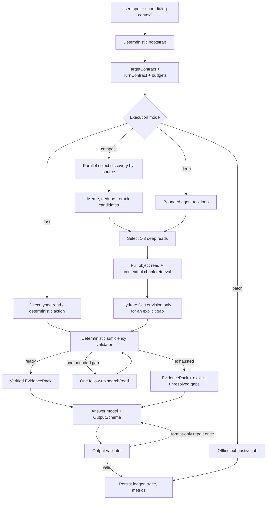
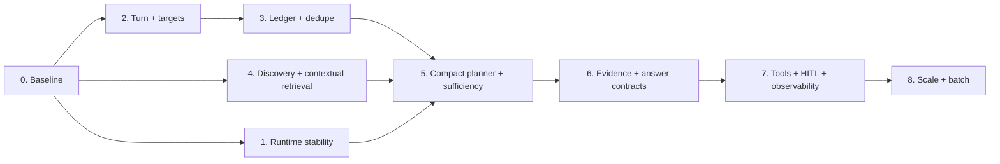

# План развития Workspace Agent: качество, предсказуемость и скорость

**Статус:** целевая архитектура и план внедрения  
**Дата:** 2026-07-18  
**Область:** Workspace Agent, RAG, planner, answer generation, Celery/runtime, evals  
**Приоритет документа:** этот план описывает целевое состояние. Старые ADR и roadmap используются только как свидетельство текущей реализации и не ограничивают решения ниже.

## 1. Цель

Довести агентную систему до production-grade уровня без обязательного перехода на более дорогую модель. Главный источник улучшения — предсказуемый цикл принятия решений:

```text
понять задачу
  -> определить конкретные targets и необходимые источники
  -> найти кандидатов
  -> точечно прочитать первоисточники
  -> проверить достаточность evidence
  -> выдать результат требуемой формы
```

Система должна становиться умнее за счёт лучшего состояния, инструментов, retrieval и проверок, а быстрее — за счёт раннего выбора самого дешёвого достаточного режима, устранения лишних LLM-вызовов, параллельного выполнения независимых операций и исправления runtime-проблем.

Нет единственного стандарта «эталонного агента». В этом плане эталон означает набор подтверждённых практик современных agent systems:

- простые и составные workflows раньше свободного agent loop;
- один понятный цикл `model -> tool -> observation -> model`, когда динамика действительно нужна;
- ground truth из инструментов после каждого действия;
- typed state и строгие контракты вместо повторного пересказа состояния моделью;
- deterministic gates для проверяемых условий;
- ограниченные бюджеты и явные stopping conditions;
- trace-first debugging и evals на реальных сценариях;
- отдельные интерактивный и exhaustive/batch пути.

## 2. Что известно о текущей проблеме

### 2.1 Измеренный проблемный чат

Для чата `b9a1ff2d-4fae-47f3-9217-b0b9423c60be` наблюдалось:

| Реплика | Время | Planner steps | Характерный маршрут |
|---|---:|---:|---|
| 1 | 102.7 с | 7 | `OpenNote -> OpenNote -> OpenPost -> FinishRetrieval x4` |
| 2 | 3.4 с | 0 | ответ без research-loop |
| 3 | 34.5 с | 4 | правильный `OpenNote`, повторный `OpenNote`, `FinishRetrieval x2` |

Это показывает, что основная задержка не является неизбежной стоимостью хорошего ответа. Она возникает из сочетания повторов, repair-loop, cold start и runtime-сбоев.

### 2.2 Подтверждённые причины задержки

1. Два Celery retry с ошибкой `Future attached to a different loop` добавили около 4.8 с и делают latency нестабильной.
2. Первая локальная инициализация embedding-модели добавила ориентировочно 25–30 с.
3. Warmup выполняется отдельным процессом до Celery и не гарантирует прогретую модель в forked worker.
4. Async helpers используют общий SQLAlchemy pool из разных event loops.
5. Planner повторно открывал уже прочитанные объекты.
6. Один и тот же `FinishRetrieval` отклонялся несколькими gates и снова отправлялся в LLM.
7. `AGENT_SYSTEM` имеет размер около 12 018 символов.
8. Каждый planner step возвращал примерно 2–5 тыс. символов при `max_tokens=1500`.
9. Planner использовал `OpenAI / gpt-4.1-mini`; unified `answer_node` также шёл через `ctx.reasoner_model`. Настроенный `deepseek-chat` не находился на критическом пути ответа.
10. Глобальный step limit не отражает сложность конкретной задачи. Простое уменьшение `RAG_AGENT_MAX_STEPS` с 10 до 4 может сократить худшие циклы, но не устраняет повторы и способно преждевременно обрезать сложные запросы. В текущем рабочем дереве default уже равен 4, поэтому дальнейшее уменьшение не является основным решением.

### 2.3 Корневой архитектурный дефект

Planner одновременно пытается:

- понять задачу;
- восстановить referents;
- спланировать поиск;
- помнить уже выполненные поиски;
- оценить evidence;
- решить, можно ли завершать;
- повторно объяснить всё это в JSON на каждом шаге.

Из-за этого модель снова принимает уже принятые решения, а несколько последующих gates пытаются исправить её постфактум. Состояние должно принадлежать приложению, а planner должен выбирать только следующее действие.

## 3. Архитектурные принципы

### 3.1 Простота раньше автономности

Для предсказуемой задачи используется workflow. Свободный agent loop включается только там, где следующий шаг нельзя надёжно определить заранее.

### 3.2 Один источник истины для состояния

Targets, corpora, search intents, candidates, opened evidence, budgets и output contract хранятся в typed run state. Модель не обязана воспроизводить их на каждом шаге.

### 3.3 Targets не равны результатам поиска

- **Target** — конкретный объект, на который указывает пользователь или диалог.
- **Corpus** — коллекция, внутри которой надо искать или сравнивать.
- **Candidate** — объект, найденный discovery.
- **Evidence** — полностью прочитанный и проверенный материал.

Semantic hit не становится target автоматически. Summary не становится evidence автоматически.

### 3.4 Доказательства только из первоисточника

`search_summary`, keywords и seed snippets нужны для discovery. Фактический ответ строится по полному объекту или релевантным контекстным чанкам, полученным после выбора кандидата.

### 3.5 Проверяемое проверяется кодом

Существование объекта, повтор tool call, закрытие обязательного source, принадлежность evidence ID, соблюдение budget и соответствие JSON Schema проверяются детерминированно. LLM не должна тратить шаг на то, что приложение уже знает.

### 3.6 Ограниченность цикла

У каждого run есть бюджеты по времени, LLM calls, searches, deep reads, tool calls и токенам. Любое намерение завершается состоянием `satisfied` или `exhausted`, а не бесконечным rewrite.

### 3.7 Качество измеряется вместе со скоростью

Оптимизация принимается только если она улучшает Pareto-профиль: не ухудшает обязательные quality gates и уменьшает latency, токены или стоимость.

## 4. Не-цели и запрещённые анти-паттерны

В рамках этого плана не следует:

- строить цепочку отдельных LLM-router/resolver/planner/critic/gate для каждого хода;
- считать уменьшение `max_steps` или `max_tokens` самостоятельной архитектурной оптимизацией;
- передавать в финальный ответ сырые summary hits как факты;
- выполнять один semantic query по всем типам источников, если у них разные роли;
- повторять поиск с переформулированным текстом без нового `intent_key` и evidence-gap;
- запускать vision «на всякий случай»;
- открывать все файлы выбранного объекта до появления конкретного пробела;
- создавать новый orchestration layer для каждого intent;
- использовать UI progress messages как доказательство реального ускорения;
- включать отдельного critic-agent без измеримого прироста на held-out evals;
- смешивать интерактивный запрос «найди достаточно» и batch-запрос «проанализируй всё»;
- доверять старому ADR, если trace, eval или более простая архитектура показывают обратное.

## 5. Целевая архитектура



Для mutation/action запросов read/research заканчивается proposal, после чего применяется существующий HITL-путь:

```text
research -> typed proposal -> policy validation -> user approval
         -> resume same run from persisted state -> execute -> verify result
```

Approval не должен запускать новый независимый reasoning cycle и терять исходные targets/evidence.

## 6. Контракты состояния

Контракты ниже являются логической схемой. Конкретная реализация может использовать Pydantic/dataclasses, но названия и инварианты должны сохраниться.

### 6.1 TargetContract

Target определяется до retrieval в bootstrap-фазе и может быть уточнён только явным resolution-событием. Для нескольких targets нужен не один `target`, а типизированный набор:

```json
{
  "target_mode": "mixed",
  "targets": [
    {
      "kind": "note",
      "id": "note-uuid",
      "role": "source",
      "authoritative": true,
      "confidence": 1.0,
      "resolved_by": "explicit_id"
    },
    {
      "kind": "post",
      "id": "post-uuid",
      "role": "subject",
      "authoritative": true,
      "confidence": 0.96,
      "resolved_by": "dialog_ledger"
    }
  ],
  "corpora": [
    {
      "kind": "feed_posts",
      "role": "comparison",
      "scope": "current_user"
    }
  ],
  "ambiguities": []
}
```

`target_mode`:

| Mode | Значение |
|---|---|
| `exact` | один конкретный объект |
| `set` | несколько конкретных объектов |
| `corpus` | конкретного объекта нет, нужен поиск в коллекции |
| `mixed` | targets плюс один или несколько corpora |
| `ambiguous` | есть несколько несовместимых трактовок, которые нельзя безопасно разрешить |

`role`:

- `subject` — объект, про который спрашивают;
- `source` — источник требований или фактов;
- `comparison` — объект/корпус для сопоставления;
- `style_reference` — материал, задающий стиль;
- `context` — вспомогательный контекст.

Инварианты:

1. У target есть provenance: explicit ID/link, exact title, open object, recent object или ledger.
2. Search candidate может быть повышен до target только отдельным `ResolveTarget` с причиной и достаточной уверенностью.
3. При равноправной неоднозначности, влияющей на результат, система задаёт один короткий вопрос пользователю.
4. Несколько targets определяются в одном bootstrap, а не последовательными planner-угадываниями.

### 6.2 TurnContract

```json
{
  "task_profile": "comparison",
  "goal": "сопоставить правила из заметки с опубликованными постами",
  "target_contract_ref": "target-contract-id",
  "required_sources": ["notes", "posts"],
  "evidence_requirements": ["note_rules", "matching_post_examples"],
  "answer_requires": ["overlaps", "differences", "evidence_citations"],
  "output_schema": "comparison.v1",
  "execution_mode": "compact",
  "budgets": {
    "soft_deadline_ms": 30000,
    "hard_deadline_ms": 60000,
    "planner_calls": 2,
    "search_calls": 3,
    "search_rewrites_per_intent": 1,
    "deep_reads": 3,
    "tool_calls": 8
  }
}
```

Начальный набор `task_profile`:

- `exact_lookup`;
- `topical_answer`;
- `workspace_synthesis`;
- `recommendation`;
- `comparison`;
- `exhaustive_inventory`;
- `artifact_revision`;
- `channel_profile_draft`;
- `mutation_proposal`.

Для `channel_profile_draft` output schema требует готовые значения полей профиля. Ответ вида «вам следует написать...» считается нарушением контракта.

### 6.3 EvidenceRequirement

```json
{
  "requirement_id": "note_rules",
  "kind": "full_text",
  "source_kind": "note",
  "target_ids": ["note-uuid"],
  "required": true,
  "status": "open",
  "evidence_ids": [],
  "gap": null
}
```

`status`: `open | satisfied | exhausted | not_applicable`.

Planner не закрывает requirement текстовым обещанием. Его статус вычисляет validator по реальным evidence records.

### 6.4 SearchIntentLedger

```json
{
  "intent_id": "intent-01",
  "intent_key": "posts:comparison:topic-normalized:current-user",
  "source_kind": "posts",
  "purpose": "найти реализации правил заметки в публикациях",
  "query": "нормализованный исходный запрос",
  "status": "satisfied",
  "attempts": 1,
  "rewrite_count": 0,
  "candidate_ids": ["post-1", "post-2"],
  "selected_ids": ["post-1"],
  "last_error": null,
  "exhausted_reason": null
}
```

Инварианты ledger:

- `intent_key` строится из source, purpose, scope и нормализованной смысловой цели, а не из raw query;
- изменение формулировки запроса не создаёт новое намерение;
- успешный или пустой повтор с тем же tool signature не выполняется повторно;
- допускается максимум один rewrite, если validator указал конкретный recoverable gap;
- после пустого rewrite intent становится `exhausted`;
- ledger сохраняется внутри run state, а полезные targets/evidence переносятся между репликами диалога с revision/provenance.

### 6.5 CandidateRecord

```json
{
  "candidate_id": "post-1",
  "object_type": "post",
  "object_id": "post-uuid",
  "title": "...",
  "search_summary": "...",
  "keywords": ["..."],
  "parent_post_id": null,
  "status": "published",
  "updated_at": "2026-07-18T10:00:00Z",
  "index_revision": 4,
  "source_intent_ids": ["intent-01"],
  "scores": {
    "lexical": 0.71,
    "vector": 0.82,
    "rerank": 0.88
  },
  "selection_reason": "topic and source-role match",
  "read_status": "summary_only"
}
```

`read_status`: `summary_only | chunk_read | full_read | rejected`.

### 6.6 Compact PlannerDecision

Planner получает state snapshot, но возвращает только решение, а не полный пересказ плана:

```json
{
  "decision_id": "decision-03",
  "decision_code": "READ_TOP_CANDIDATES",
  "actions": [
    {
      "tool": "OpenObjects",
      "args": {"object_ids": ["post-1", "post-2"]},
      "intent_id": "intent-01"
    }
  ],
  "state_updates": {
    "selected_candidate_ids": ["post-1", "post-2"]
  },
  "confidence": 0.91
}
```

Разрешённые decision codes должны быть конечным enum, например:

- `USE_FAST_PATH`;
- `SEARCH_REQUIRED_SOURCE`;
- `READ_EXPLICIT_TARGET`;
- `READ_TOP_CANDIDATES`;
- `HYDRATE_EVIDENCE_GAP`;
- `RESOLVE_AMBIGUITY`;
- `PROPOSE_MUTATION`;
- `FINISH_READY`;
- `FINISH_PARTIAL`.

Из ответа planner удаляются полные observations, повторный task contract, длинный rationale и «план ответа». Для observability достаточно decision code, tool args, confidence и ссылок на state. Chain-of-thought не хранится и не показывается.

Целевой output budget planner после перехода на schema: 300–500 токенов. Сначала сокращается контракт ответа, затем `max_tokens`. Простое снижение лимита при старом формате повысит invalid JSON rate.

### 6.7 SufficiencyResult

```json
{
  "status": "ready",
  "satisfied_requirements": ["note_rules", "matching_post_examples"],
  "open_requirements": [],
  "exhausted_requirements": [],
  "allowed_next_intent_ids": [],
  "evidence_ids": ["note:...@rev:4", "post:...@rev:9"],
  "decision_code": "ALL_REQUIRED_EVIDENCE_PRESENT"
}
```

`status`: `ready | follow_up_allowed | exhausted | invalid`.

`ready` возможен только когда:

1. обязательные sources представлены;
2. explicit targets открыты в нужной полноте;
3. summary-кандидаты, влияющие на ответ, прочитаны полностью или контекстными чанками;
4. нужные attachments/vision hydrated;
5. каждый обязательный `EvidenceRequirement` закрыт;
6. нет незавершённых search intents;
7. EvidencePack позволяет заполнить output schema.

### 6.8 Output schemas

Каждый профиль результата получает versioned schema. Минимальные примеры:

- `answer.v1`: `text`, `evidence_ids`, `unresolved`;
- `comparison.v1`: `basis`, `common`, `differences`, `conclusion`, `evidence_ids`;
- `channel_profile.v1`: готовые `name`, `description`, `topics`, `audience`, `tone`, `posting_principles`;
- `artifact_revision.v1`: `artifact`, `change_summary`, `source_evidence_ids`;
- `mutation_proposal.v1`: `action`, `target_ids`, `patch`, `preview`, `risk`, `approval_required`.

Output validator проверяет форму и evidence references. Одна format-only repair попытка допустима; она не имеет права запускать новый retrieval или добавлять факты.

## 7. Когда и как определяется target

Target resolution выполняется до первого поиска в следующем порядке:

1. Извлечь explicit UUID, canonical URL и route ID.
2. Учесть текущий открытый объект и scope интерфейса.
3. Сопоставить точное название в доступном пользователю scope.
4. Разрешить deictic references («эта заметка», «они», «предыдущий пост») через короткий dialog context и ledger.
5. Выделить все упомянутые конкретные объекты и назначить им роли.
6. Отдельно выделить corpora: «мои посты», «все заметки», «аналитика канала».
7. Если deterministic resolution недостаточен, выполнить bounded semantic resolution по catalog/summary.
8. Если остаются две существенно разные трактовки с близкой уверенностью, спросить пользователя до дорогого retrieval.

Target может уточняться после discovery только в двух случаях:

- пользователь фактически указал объект названием, а discovery нашёл его ID;
- planner выполнил явное `ResolveTarget`, а validator подтвердил uniqueness и provenance.

Нельзя менять target только потому, что другой semantic hit имеет больший score. Это защищает от «дрейфа темы».

### Пример нескольких targets

Запрос: «Возьми правила из этой заметки, сравни их с постами 12 и 18 и предложи новый профиль канала».

```text
targets:
  note/current       role=source
  post/12            role=comparison
  post/18            role=comparison
corpora:
  channel analytics  role=context, только если schema требует audience data
task_profile:
  channel_profile_draft
```

Все эти элементы определяются одним TurnContract. Planner не должен сначала забыть заметку, затем отдельно «обнаружить» два поста.

## 8. Режимы исполнения

### 8.1 Deterministic fast path

Подходит для:

- explicit target + exact lookup;
- чтения недавно созданной заметки;
- получения известной метрики;
- применения уже одобренной mutation;
- ответа, полностью покрытого валидным ledger evidence той же revision.

Маршрут: bootstrap -> один typed tool/batch tool -> sufficiency -> answer. Planner LLM не вызывается.

Цель: 0 planner calls, 1–2 tool calls.

### 8.2 Compact planner path

Подходит для обычного topical search, comparison, recommendation и synthesis по нескольким источникам.

Маршрут: bootstrap -> параллельный discovery -> один planner decision -> 1–3 deep reads -> sufficiency -> при необходимости один follow-up -> answer.

Цель: 1–2 planner calls, максимум одна дополнительная поисковая итерация.

### 8.3 Deep agent path

Подходит для действительно динамических multi-hop задач, когда следующий source зависит от содержимого предыдущего.

Маршрут остаётся `model -> tool -> observation`, но:

- использует то же typed state;
- подчиняется search ledger и budgets;
- выполняет независимые tool calls параллельно;
- прекращается сразу после deterministic sufficiency;
- не имеет глобального бесконтрольного repair-loop.

### 8.4 Batch/exhaustive path

`exhaustive_inventory` и «проанализируй вообще всё» не выполняются в интерактивном SLA. Создаётся resumable job с pagination, progress, checkpoint и отдельным лимитом стоимости. Результат materialized и может быть использован интерактивным answer path после завершения.

## 9. Discovery и retrieval

### 9.1 Два уровня индекса

Использовать два взаимодополняющих уровня:

1. **Object-level discovery** — title, `search_summary`, keywords, metadata. Он дешёво выбирает кандидатов.
2. **Contextual chunk retrieval** — contextualized chunks + lexical/vector hybrid search внутри выбранных объектов. Он находит доказательства.

Одних object summaries недостаточно: они полезны для recall кандидатов, но теряют детали и не должны заменять contextual retrieval.

### 9.2 Discovery metadata

Для поста и заметки хранить:

```text
search_summary       до 120–160 символов
keywords             5–10 нормализованных терминов
object_type
status
parent_post_id
updated_at
index_revision
```

Summary создаётся асинхронно. Пока не готово, fallback: нормализованный title + начало текста. Первую версию можно хранить как `note_summary` и `post_summary` nodes в существующей embeddings table, не создавая отдельную инфраструктуру.

### 9.3 Contextual chunks

При индексировании каждый chunk получает короткий контекст объекта, например 50–100 токенов:

```text
Документ: заметка «Редакционная политика».
Раздел: структура обучающих публикаций.
Этот фрагмент описывает требования к вступлению.

<original chunk>
```

Контекст участвует в lexical/vector индексе, но evidence сохраняет ссылку на original text, object ID, revision и offsets.

### 9.4 Candidate-first алгоритм

1. Из `required_sources` создать отдельный intent на каждый source/role.
2. Сформировать разные запросы, например `notes_query` для правил и `posts_query` для реализаций.
3. Выполнить независимые discovery queries параллельно.
4. Получить не более 5 object candidates на источник.
5. Объединить lexical/vector результаты через rank fusion, затем применить metadata filters и rerank.
6. Deduplicate по canonical object ID и revision.
7. Выбрать для deep read 1–3 объекта суммарно или по explicit budget профиля.
8. Выполнить hybrid chunk search только внутри выбранных объектов.
9. Полностью открыть короткие заметки/посты; для больших документов сначала читать релевантные chunks и соседний контекст.
10. Открывать attachment или vision только для конкретного незакрытого EvidenceRequirement.

### 9.5 Выравнивание текущих retrieval paths

`hybrid_prefetch` и `retrieve_for_chat` должны использовать одну retrieval policy:

- одинаковые tenant/scope filters;
- одинаковую нормализацию типов и IDs;
- одинаковые revision/status rules;
- единый формат score/provenance;
- единый dedupe;
- один ledger cache.

`hybrid_prefetch` может быть оптимизированным entrypoint, но не параллельной семантикой поиска.

## 10. Planner protocol

### 10.1 Что решает planner

Planner решает только то, что нельзя надёжно вывести из state:

- какой из допустимых search intents выполнить следующим;
- какие кандидаты глубоко прочитать;
- какой explicit evidence-gap требует file/vision;
- нужна ли genuine clarification;
- какой action proposal сформировать.

### 10.2 Что planner не решает

Planner не должен:

- повторно классифицировать уже зафиксированный task profile;
- повторно пересказывать targets и observations;
- самостоятельно считать budgets;
- решать, существует ли evidence ID;
- вызывать `FinishRetrieval` несколько раз в надежде пройти gates;
- создавать task «синтезировать ответ» внутри retrieval plan;
- выбирать user answer model.

### 10.3 Единый stopping rule

После каждого tool result приложение обновляет records и вызывает sufficiency validator.

```text
if ready:
    stop research immediately
elif one bounded recoverable gap and budget remains:
    allow exactly the linked follow-up intent
elif ambiguity blocks correctness:
    ask user
else:
    mark remaining intents exhausted and finish partial
```

`FinishRetrieval` может остаться внутренним событием графа, но не должен требовать повторного LLM-вызова. Validator сам переводит run в `ready`/`partial`.

### 10.4 Динамические бюджеты вместо одного max_steps

| Profile/mode | Planner | Search | Deep read | Expected tool calls |
|---|---:|---:|---:|---:|
| exact/fast | 0 | 0 | 1 | 1–2 |
| topical/compact | 1 | 1–2 | 1–2 | 3–5 |
| comparison/compact | 1–2 | 2–3 | 2–3 | 4–8 |
| synthesis/deep | до 3 | до 4 | до 5 | до 12 |
| exhaustive/batch | job-specific | paginated | paginated | не interactive |

Budgets являются ceiling, а не целью. `ready` всегда завершает run раньше.

### 10.5 Сокращение ответов planner без деградации

Сокращать planner нужно, но в правильной последовательности:

1. Вынести полный plan, observations, ledger и requirements в state.
2. Заменить свободный JSON на строгий `PlannerDecision`.
3. Ограничить enum действий и tool schemas.
4. Добавить deterministic validation и retry только для invalid schema.
5. После этого снизить output budget до 300–500 токенов.
6. Сравнить exact same traces на golden set.

Это не ухудшает reasoning: модели оставляют ту часть решения, которая действительно нужна. Деградация возникнет, если просто обрезать старый 2–5-тысячный ответ без переноса состояния в приложение.

## 11. Tool design

Инструменты должны быть ориентированы на задачи агента, а не механически повторять внутренний API.

### 11.1 Требования

- строгие входные и выходные schemas;
- namespace по домену: `workspace.search`, `workspace.read`, `analytics.read`, `actions.propose`;
- canonical IDs и evidence IDs во всех ответах;
- high-signal result с provenance, revision и next-action hints;
- `compact` и `detailed` response modes;
- pagination/filtering для больших коллекций;
- actionable errors: `already_opened`, `not_found`, `forbidden`, `stale_revision`, `empty_scope`;
- idempotency key/tool signature;
- batch input для независимых чтений.

### 11.2 Консолидация

Стоит иметь небольшое число содержательных tools вместо множества тонких wrappers:

- `ResolveObjects(refs[])`;
- `SearchObjects(intents[])`;
- `OpenObjects(ids[], mode)`;
- `SearchObjectChunks(object_ids[], query)`;
- `HydrateAttachments(attachment_ids[], evidence_need)`;
- `ReadAnalytics(metric_set, scope)`;
- `ProposeAction(action, targets, patch)`.

Консолидация не означает универсальный «do everything» tool. Каждый tool имеет понятную ответственность и typed result.

### 11.3 Повторы и кэш

Tool signature строится из tool name, canonical args, user/scope и object revision. Повтор успешного read возвращается из run cache без внешнего вызова. Повтор пустого search в том же intent запрещается до разрешённого rewrite.

## 12. EvidencePack и финальная генерация

Финальная модель получает только:

- текущую пользовательскую задачу;
- TurnContract и конкретный output schema;
- краткий релевантный dialog context;
- проверенные полные тексты или contextual chunks;
- необходимые file extracts/vision descriptions;
- evidence IDs и unresolved gaps.

Она не получает:

- сырые seed hits;
- object summaries вместо доказательств;
- весь research transcript;
- все прошлые planner decisions;
- внутренние retry/errors, не влияющие на ответ;
- длинный общий `AGENT_SYSTEM`.

### 12.1 Разделение моделей

Модели выбираются независимо:

- **planner model** — структурированный output, низкая temperature, стабильный tool selection;
- **answer model** — пользовательская модель/настройка, качество текста и следование output schema;
- **embedding/rerank models** — отдельная retrieval policy.

`answer_node` не должен автоматически использовать `ctx.reasoner_model`. Иначе сравнение DeepSeek и других answer models некорректно, а пользовательская настройка фактически игнорируется.

Сначала исправляется protocol и evidence, затем модели сравниваются на одном golden set. Более дорогая модель допускается только для escalation, если измеренный прирост оправдывает latency/cost.

### 12.2 Prompt modularization

После стабилизации protocol разбить `AGENT_SYSTEM` на:

- короткое неизменяемое core policy;
- task-profile instructions;
- tool schemas/descriptions;
- output schema;
- компактный state snapshot.

Не включать инструкции для недоступных в текущем mode tools. Кэшировать стабильный prefix, если provider поддерживает prompt caching. Цель — сократить вход, не потеряв инварианты.

## 13. Runtime и производительность

### 13.1 Приоритет 1: убрать технические stalls

1. Ввести один долгоживущий event loop на Celery worker/process для agent tasks.
2. Не переносить async SQLAlchemy connections/futures между loops.
3. После fork создавать новый engine/pool либо явно dispose/reinitialize pool в child process.
4. Убрать nested `asyncio.run` и смешение loop ownership в helpers.
5. Классифицировать `Future attached to a different loop` как programming/runtime error, а не обычный transient retry.
6. Добавить integration test: несколько последовательных и параллельных agent runs в одном worker.

Ожидаемый эффект: устранение 4–10 с retry penalty и длинного нестабильного хвоста p95/p99.

### 13.2 Приоритет 2: настоящий warmup

1. Инициализировать embedding runtime внутри каждого worker process после fork.
2. Выполнить реальный тестовый `embed`, а не только import/model load.
3. Отмечать worker `ready` только после warmup или маршрутизировать cold worker отдельно.
4. Хранить метрики `embedding_init_ms`, `first_embed_ms`, `worker_warm`.
5. Для autoscaling определить минимальное число warm workers.

Ожидаемый эффект: убрать 25–30 с из первого пользовательского запроса.

### 13.3 Приоритет 3: очереди и изоляция ресурсов

Разделить Celery queues и concurrency policy:

- `agent-interactive`;
- `telegram-io`;
- `analytics`;
- `media`;
- `agent-batch`.

Interactive agent не должен ждать vision/media или массовую аналитику. Для каждой очереди задать отдельные time limits, prefetch multiplier и autoscaling.

### 13.4 Приоритет 4: меньше последовательных round trips

- target bootstrap выполнять один раз;
- parallel discovery по независимым sources;
- batch open для 2–3 выбранных объектов;
- parallel attachment hydration, если gaps независимы;
- немедленный finish после sufficiency;
- planner и answer не дублируют retrieval;
- DB metadata queries объединять, не делать N+1.

### 13.5 Deadlines и graceful degradation

Рекомендуемые interactive deadlines:

- soft deadline: 30 с;
- hard deadline: 60 с;
- после soft deadline — запрещать новые exploratory intents, завершать существующий read и формировать partial;
- перед hard deadline — сохранять checkpoint и возвращать честный результат/предложение batch mode.

Streaming progress улучшает perceived latency, но не заменяет оптимизацию time-to-final. Отдельно измерять time-to-first-event, time-to-first-token и time-to-final.

## 14. SLO и метрики

### 14.1 Целевые SLO

| Класс | P95 time-to-final |
|---|---:|
| Без workspace retrieval | < 6 с |
| Exact note/post lookup | < 15 с |
| Обычный workspace query | < 25 с |
| Сложный multi-hop query | < 45 с |
| Interactive hard cap | 60 с |

Дополнительные targets:

- duplicate successful tool calls: `0`;
- wasted planner steps: `< 10%`;
- invalid planner outputs: `< 1%`;
- unresolved intent without `exhausted_reason`: `0`;
- factual claims without evidence: `0` для строгих factual profiles;
- target resolution accuracy: `>= 95%` overall и `100%` для explicit IDs;
- output schema compliance after optional repair: `>= 99%`.

### 14.2 Trace schema

Каждый run должен содержать:

- timestamps каждого phase;
- TurnContract и revisions;
- target resolution provenance;
- planner decision codes;
- tool signature, duration, cache hit, result count/error;
- search intent transitions;
- candidate -> evidence lineage;
- sufficiency result;
- input/output tokens и model per call;
- queue wait, cold-start и DB timings;
- final validation result.

Нельзя логировать секреты, полные private attachments без необходимости или скрытый chain-of-thought.

### 14.3 Derived metrics

- `queue_wait_ms`, `bootstrap_ms`, `discovery_ms`, `deep_read_ms`, `answer_ms`;
- planner calls/run и tokens/decision;
- searches/intent, rewrite rate, exhausted rate;
- candidates/source, opened/candidate ratio;
- duplicate suppression count;
- evidence coverage и groundedness;
- fast/compact/deep/batch distribution;
- cold vs warm latency;
- cost per successful scenario.

## 15. Golden set и оценка качества

### 15.1 Набор

Собрать 30–50 реальных сценариев, включая `b9a1ff2d-4fae-47f3-9217-b0b9423c60be`. Хранить production-like fixtures с очищенными персональными данными.

Для каждого сценария зафиксировать:

- user turns и UI scope;
- ожидаемый `target_mode`, targets, roles и corpora;
- required sources/evidence kinds;
- объекты, которые должны быть открыты;
- объекты, которые не должны быть открыты;
- обязательные/запрещённые tool calls;
- output schema и semantic acceptance criteria;
- допустимые search/deep-read/planner budgets;
- latency class;
- ожидаемое поведение при отсутствии данных.

### 15.2 Слои eval

1. **Deterministic unit:** schema, target extraction, ledger transitions, dedupe, budgets, sufficiency.
2. **Trajectory:** correct tools/sources, no duplicate opens, stopping at first ready state.
3. **Retrieval:** candidate recall@k, evidence recall, irrelevant open rate, rerank quality.
4. **Answer:** groundedness, completeness, output form, citation validity.
5. **System:** p50/p95, tokens, cost, queue/cold start, retry rate.
6. **Human review:** ambiguous or stylistic tasks; judge rubric калибруется на размеченных примерах.

Trace grading используется для локализации ошибки, затем воспроизводимая проверка добавляется в dataset/CI.

### 15.3 Обязательная тестовая матрица

| Сценарий | Ожидаемое поведение |
|---|---|
| Explicit note ID, «прочитай» | exact target, один `OpenNote`, без search/planner |
| «Эта заметка» после создания | target из recent object/ledger, без semantic drift |
| Два конкретных поста | `target_mode=set`, batch open, оба в evidence |
| Заметка + «мои посты» | `mixed`: note target + posts corpus, separate intents |
| Сравнение notes/posts | отдельные queries, оба required sources закрыты |
| Один query переформулирован planner | тот же `intent_key`, максимум один rewrite |
| Search пуст дважды | `exhausted`, честный gap, без третьего поиска |
| Summary релевантен, full text нет | summary не попадает в evidence, кандидат отклонён |
| Attachment нужен для ответа | hydrate только указанный attachment |
| Image не влияет на вопрос | vision calls = 0 |
| Ambiguous same-name objects | clarification до deep read |
| `channel_profile_draft` | готовые поля профиля по schema |
| Exhaustive inventory | batch job, не interactive loop |
| Mutation | proposal + approval + resume same run |
| Empty evidence | нет выдуманных фактов |
| Chat `b9a1ff2d-...`, turn 1 | без duplicate opens и repeated finish; < 25 с warm P95 class |
| Chat `b9a1ff2d-...`, turn 3 | один правильный open, finish автоматически |
| Cold worker | warmup metric виден; пользовательский run не платит полный init |
| Multiple Celery runs | нет cross-loop Future и retries |

## 16. План внедрения

Каждая фаза включается feature flag, сравнивается на одном golden set и может быть откатана независимо. Оценки времени ориентировочные и уточняются после фазы 0.

### Фаза 0. Baseline, traces и quality freeze

**Срок:** 2–4 рабочих дня.  
**Зависимости:** нет.

Работы:

1. Сохранить traces проблемного чата и ещё 29–49 сценариев.
2. Ввести единый scenario fixture format.
3. Зафиксировать текущие p50/p95, calls, tokens, tool trajectories, target accuracy.
4. Добавить deterministic graders для duplicate calls, valid evidence IDs, finish loops и output schema.
5. Разделить cold/warm measurements.
6. Зафиксировать quality floor: какие сценарии нельзя ухудшать ни на одном этапе.

Exit criteria:

- набор воспроизводится локально/в CI;
- каждый известный failure имеет trace и ожидаемый результат;
- baseline содержит не только среднее, но p50/p95/p99 и per-phase timing.

Риск: fixtures не отражают production.  
Снижение риска: регулярно добавлять анонимизированные реальные traces и держать held-out subset.

Ожидаемый latency impact: прямого нет; появляется измеримость.

### Фаза 1. Стабилизация async runtime и cold start

**Срок:** 3–5 дней.  
**Зависимости:** фаза 0 для измерения.

Работы:

1. Зафиксировать ownership event loop в Celery worker.
2. Пересоздавать SQLAlchemy engine/pool после fork.
3. Удалить cross-loop sharing из async helpers.
4. Перенести embedding warmup внутрь worker init и выполнить real embed.
5. Разделить interactive и heavy queues.
6. Добавить runtime health/ready probe и cold-start metrics.

Exit criteria:

- 1000 последовательных/параллельных тестовых runs без `different loop`;
- retry rate по этой причине равен нулю;
- warm run не инициализирует embeddings;
- cold penalty не попадает в первый accepted interactive task.

Риск: fork lifecycle различается между dev/prod.  
Снижение риска: integration tests на том же Celery pool type, что production.

Ожидаемый impact: минус 25–30 с для первого запроса; минус 4–10 с на affected retries; существенное снижение p95/p99.

### Фаза 2. Typed TurnContract и multi-target bootstrap

**Срок:** 4–7 дней.  
**Зависимости:** фаза 0; может идти параллельно с фазой 1 после фиксации интерфейсов.

Работы:

1. Версионировать `TargetContract`, `TurnContract`, roles и modes.
2. Реализовать deterministic resolution explicit ID/link/open/recent/ledger.
3. Разделить targets, corpora и candidates.
4. Добавить multi-target и ambiguity policy.
5. Переносить goal/targets между turns с provenance/revision.
6. Расширить распознавание ссылок на notes/posts.
7. Добавить execution mode и budgets по task profile.

Exit criteria:

- explicit IDs: 100% correct;
- golden target accuracy >= 95%;
- semantic hits никогда не становятся target без resolution event;
- multi-target scenarios не теряют объекты между nodes/turns.

Риск: regex/deterministic rules разрастаются.  
Снижение риска: deterministic rules покрывают только high-confidence signals; сложное resolution остаётся одним bounded fallback, а не цепочкой resolvers.

Ожидаемый impact: 0 planner calls на exact path; минус 1–3 LLM calls на referent-heavy turns.

### Фаза 3. Search ledger и устранение повторов

**Срок:** 3–5 дней.  
**Зависимости:** TurnContract.

Работы:

1. Добавить `SearchIntentLedger` в run state/checkpoint.
2. Ввести semantic `intent_key` и canonical tool signatures.
3. Реализовать states `planned/running/satisfied/exhausted`.
4. Разрешить только один gap-linked rewrite.
5. Кэшировать успешные reads и empty search outcomes внутри run.
6. Убрать повторный LLM `FinishRetrieval`; завершать через validator event.
7. Согласовать `hybrid_prefetch` и `retrieve_for_chat`.

Exit criteria:

- duplicate successful external calls = 0;
- один intent не исполняется более двух раз с rewrite;
- repeated `FinishRetrieval` отсутствует во всех golden traces;
- planner честно получает `exhausted_reason`.

Риск: слишком агрессивный dedupe блокирует полезный поиск.  
Снижение риска: signature включает scope/revision, а новый intent разрешён только при новом evidence requirement.

Ожидаемый impact: минус 1–4 planner/tool round trips в проблемных сценариях; экономия 5–30 с в зависимости от provider latency.

### Фаза 4. Discovery summaries и contextual hybrid retrieval

**Срок:** 5–8 дней.  
**Зависимости:** фаза 0; ledger желательно готов.

Работы:

1. Добавить object metadata и async summary generation.
2. Использовать existing embeddings table для summary nodes на первой итерации.
3. Добавить fallback title + leading text.
4. Создать contextual chunks с object/section context.
5. Реализовать lexical + vector retrieval и rank fusion.
6. Фильтровать по tenant/type/status/scope до или во время retrieval.
7. Ввести object candidate limit 5/source и selected deep-read limit 1–3.
8. Запускать chunk search только внутри selected candidates.
9. Измерить recall/rerank до выбора новых индексов.

Exit criteria:

- candidate recall@5 проходит golden threshold;
- evidence recall не хуже baseline;
- irrelevant deep reads снижаются минимум на 30%;
- summary IDs не принимаются answer validator как evidence;
- stale index revision обнаруживается и не выдаётся как актуальный факт.

Риск: summaries ухудшают recall редких деталей.  
Снижение риска: hybrid discovery и contextual chunks; summary — не единственный индекс.

Ожидаемый impact: меньше full-object reads и токенов; discovery по sources параллелен. Точный latency gain определяется benchmark.

### Фаза 5. Компактный planner и deterministic sufficiency

**Срок:** 5–8 дней.  
**Зависимости:** TurnContract, ledger, evidence requirements.

Работы:

1. Ввести compact `PlannerDecision` schema и enum decision codes.
2. Перенести plan/observations/gaps из LLM output в run state.
3. Разрешить parallel actions в одном decision.
4. Реализовать deterministic `SufficiencyResult`.
5. Удалить каскад prefetch/plan repair gates или свести его к одному validator.
6. Добавить раннее завершение после каждого tool result.
7. Ввести dynamic budgets и soft/hard deadlines.
8. После стабилизации снизить planner output budget до 300–500 токенов.

Exit criteria:

- invalid planner output < 1%;
- planner calls соответствуют mode budgets;
- wasted planner steps < 10%;
- quality floor не ухудшился;
- problematic chat не содержит duplicate open/finish loop.

Риск: validator окажется слишком жёстким.  
Снижение риска: requirements формируются profile-specific, есть `exhausted/partial`, shadow traces сравнивают старое и новое решение.

Ожидаемый impact: planner output сокращается примерно в 3–5 раз; минус несколько LLM calls; normal workspace P95 приближается к <25 с.

### Фаза 6. EvidencePack, output contracts и model separation

**Срок:** 4–6 дней.  
**Зависимости:** sufficiency и contextual evidence.

Работы:

1. Сформировать минимальный verified EvidencePack.
2. Не передавать answer model сырые summaries/transcript.
3. Отделить `planner_model` от `answer_model` в runtime context/config.
4. Добавить versioned output schemas и schema validator.
5. Разрешить одну format-only repair.
6. Добавить groundedness/citation gates для factual profiles.
7. Модульно сократить system prompts и измерить prompt caching.

Exit criteria:

- выбранная user answer model действительно находится на answer path;
- factual claims имеют valid evidence;
- output schema compliance >= 99%;
- answer input tokens снижаются без падения completeness.

Риск: слишком маленький context pack теряет важную связь.  
Снижение риска: requirement coverage и neighbor chunks, а не произвольный global truncation.

Ожидаемый impact: меньше input/output tokens, предсказуемое answer latency, корректное сравнение моделей.

### Фаза 7. Tool consolidation, HITL resume и observability

**Срок:** 4–7 дней.  
**Зависимости:** contracts стабильны.

Работы:

1. Сгруппировать tools вокруг agent tasks и добавить batch variants.
2. Унифицировать typed errors и response modes.
3. Связать proposals/approvals с тем же persisted run state.
4. Добавить полную trace schema и phase metrics.
5. Реализовать dashboards и alerts по SLO/error budget.
6. Добавить trace replay и comparison report old/new.

Exit criteria:

- approval/resume не теряет targets/evidence;
- любой slow run раскладывается по phase timings;
- tool errors дают planner допустимый следующий шаг;
- dashboards показывают cold/warm и execution mode отдельно.

Ожидаемый impact: меньше tool round trips и быстрее диагностика regressions.

### Фаза 8. Масштабирование и batch path

**Срок:** 4–8 дней после реальных замеров.  
**Зависимости:** стабильный retrieval benchmark.

Работы:

1. Создать benchmark corpus: минимум 1000 постов + 1000 заметок на tenant-like scope.
2. Добавить GIN/full-text индекс для `title + summary + keywords`.
3. Добавить metadata indexes по user/type/status/scope/revision.
4. Включать HNSW только если explain/benchmark подтверждает bottleneck и recall.
5. Реализовать resumable `agent-batch` path с pagination/checkpoints.
6. Установить p95 DB latency и maximum DB/LLM calls per profile.
7. Провести load test на realistic queue mix.

Exit criteria:

- interactive SLO выдерживается на benchmark corpus;
- query plans используют ожидаемые indexes;
- batch не влияет на interactive error budget;
- HNSW добавлен только при доказанном преимуществе.

Риск: преждевременная инфраструктурная сложность.  
Снижение риска: индексы выбираются после measurement, не по предположению.

## 17. Порядок внедрения и зависимости



Практические релизы:

1. **Release A, correctness foundation:** фазы 0–3.
2. **Release B, smarter retrieval:** фаза 4.
3. **Release C, faster reasoning:** фазы 5–6.
4. **Release D, production hardening:** фазы 7–8.

Runtime stability из фазы 1 можно выпускать раньше отдельно: она не зависит от изменения semantics.

## 18. Ожидаемый суммарный эффект

| Изменение | Качество | Скорость |
|---|---|---|
| Deterministic target bootstrap | меньше ошибок referent/multi-target | убирает planner на exact path |
| Search ledger + dedupe | не теряются намерения, честный exhausted | убирает повторные search/open |
| Object discovery summaries | выше precision выбора объектов | меньше deep reads |
| Contextual hybrid chunks | выше recall деталей и groundedness | меньше лишнего full-text context |
| Compact planner | решения стабильнее и валидируемы | меньше output tokens/call |
| Deterministic sufficiency | нет premature finish/repair ping-pong | немедленная остановка |
| Model separation | корректный пользовательский answer model | дешёвый planner не диктует весь path |
| Worker warmup/event-loop fix | меньше runtime ошибок | убирает 25–30 с cold hit и retry tail |
| Parallel/batch tools | полнота нескольких sources | меньше последовательных round trips |
| Batch exhaustive path | честная полнота больших задач | interactive queue не блокируется |

Для проблемного warm-сценария целевая траектория должна выглядеть примерно так:

```text
bootstrap targets (code)
  -> OpenNote once
  -> optional SearchObjects(posts) once
  -> OpenObjects(top candidates) once
  -> sufficiency ready (code)
  -> answer
```

Без повторных `OpenNote`, без четырёх `FinishRetrieval`, без нового LLM-вызова только ради прохождения gate.

## 19. Rollout, flags и rollback

Рекомендуемые временные flags:

```text
AGENT_TURN_CONTRACT_V2
AGENT_MULTI_TARGET_V2
AGENT_SEARCH_LEDGER_V2
AGENT_DISCOVERY_SUMMARY_V1
AGENT_CONTEXTUAL_RETRIEVAL_V1
AGENT_COMPACT_PLANNER_V2
AGENT_SUFFICIENCY_V2
AGENT_MODEL_SEPARATION_V1
AGENT_BATCH_PATH_V1
```

Правила rollout:

1. Сначала shadow mode: новый path строит contract/decision, но ответ выдаёт старый.
2. Сравнивать targets, trajectories, evidence coverage, latency и cost.
3. Затем internal users, 5% canary, 25%, 50%, 100%.
4. Rollback выполняется одним flag на фазу, без отката schema migrations.
5. Новые DB fields должны быть additive; старый path игнорирует их.
6. Summary/context indexes перестраиваются versioned jobs и переключаются atomic revision.
7. Автоматически останавливать rollout при quality floor regression, cross-tenant result, groundedness failure или p95 выше установленного error budget.

Не следует держать два полноценных planner stack долго. После стабильного canary старый path удаляется, иначе двойная архитектура станет постоянным источником расхождений.

## 20. Предполагаемая карта изменений

Это ориентир для реализации после аудита текущих незавершённых изменений, а не требование сохранить нынешние границы любой ценой.

| Область | Основные файлы |
|---|---|
| Turn/target contracts | `backend/app/services/agent/runtime/turn_contract.py`, при необходимости `runtime/target_contract.py` |
| Run state/checkpoint | `backend/app/services/agent/runtime/state.py`, `runs.py`, `checkpoint.py` |
| Execution modes/budgets | `backend/app/services/agent/runtime/executor.py`, `budget.py`, `workspace_graph.py` |
| Planner protocol | `backend/app/services/agent/research/graph.py`, `plan.py` |
| Ledger/dedupe | `backend/app/services/agent/research/search_ledger.py`, `rag_dialog_ledger.py` |
| Sufficiency/evidence | `backend/app/services/agent/research/sufficiency.py`, `verifier.py`, `pack.py`, `evidence.py` |
| Discovery/retrieval | `backend/app/services/agent/research/discovery.py`, `prefetch.py`, `backend/app/services/ai/rag_retrieval_policy.py`, `rag_tools.py` |
| Embeddings/context chunks | `backend/app/services/ai/embeddings.py` и indexing jobs |
| Answer/model selection | `backend/app/services/agent/runtime/workspace_graph.py`, `context.py`, AI profile/model resolver |
| Async/Celery | `backend/app/tasks/async_runtime.py`, `agent_runs.py`, `backend/app/db/session.py`, `docker-compose.yml` |
| Observability | `runtime/trace.py`, `observability.py`, `events.py`, `sse_events.py` |
| Tests | `backend/tests/test_agent_*`, `test_turn_contract.py`, `test_rag_*`, новые scenario fixtures |

Новые модули создаются только там, где отделяют стабильный контракт (`target_contract`, `search_ledger`, `sufficiency`, `discovery`) от большого graph-файла. Не создавать отдельный resolver/router/gate module на каждый intent.

## 21. Definition of Done

Система считается доведённой до целевого уровня, когда одновременно выполняются условия:

1. Все critical golden scenarios проходят deterministic и semantic gates.
2. Explicit и multi-target resolution соответствует ожидаемому контракту.
3. Targets, corpora, candidates и evidence не смешиваются.
4. Один search intent не повторяется бесконтрольно.
5. Relevant summary candidate полностью/контекстно прочитан до использования в ответе.
6. Retrieval завершается первым deterministic `ready`, без LLM finish ping-pong.
7. Empty/insufficient evidence приводит к явному gap, а не выдуманному факту.
8. Output соответствует task-specific schema.
9. Planner и answer model выбираются независимо.
10. Нет cross-loop runtime errors и embedding cold start на принятом interactive run.
11. P95 соответствует SLO по каждому классу задач.
12. Trace объясняет время и решение каждого run без хранения скрытого reasoning.
13. Mutation выполняется только после approval и resume того же persisted state.
14. Exhaustive задачи выполняются batch-путём.
15. Старый planner path удалён после успешного rollout; временные flags имеют дату удаления.

## 22. Решение по «костылям» и риску деградации

Этот план не гарантирует отсутствие ошибок сам по себе, но специально снижает риск архитектурных костылей:

- правила target resolution ограничены high-confidence сигналами, а не превращаются в бесконечный набор regex;
- LLM остаётся там, где нужна семантика, но не хранит состояние системы в собственном тексте;
- summaries дополняют contextual retrieval, а не подменяют его;
- budgets зависят от профиля задачи, а не глобально обрезают все запросы;
- validators проверяют формальные инварианты, а не пытаются оценить смысл ответа вместо модели;
- каждый этап имеет golden gate, shadow mode и rollback;
- новые слои вводятся только если уменьшают сложность существующего graph/runtime.

Главный критерий: изменение не принимается потому, что «архитектурно красиво». Оно принимается, если на held-out сценариях сохраняет или улучшает target accuracy, evidence coverage, groundedness и output compliance при меньшей latency/стоимости.

## 23. Источники и основания

Основные актуальные руководства, использованные для целевой архитектуры:

- [Anthropic: Building effective agents](https://www.anthropic.com/engineering/building-effective-agents) — простые composable patterns, workflows vs agents, ground truth, stopping conditions.
- [Anthropic: Writing effective tools for agents](https://www.anthropic.com/engineering/writing-tools-for-agents) — high-signal tools, schemas, errors, pagination, realistic evals.
- [Anthropic: Contextual Retrieval](https://www.anthropic.com/news/contextual-retrieval) — contextual chunks, hybrid lexical/vector retrieval и необходимость измерять retrieval choices.
- [OpenAI: Agents](https://developers.openai.com/api/docs/guides/agents) — typed state, tracing, guardrails и выбор между собственным loop и SDK.
- [OpenAI: Running agents](https://developers.openai.com/api/docs/guides/agents/running-agents) — базовый model/tool loop и resumable state.
- [OpenAI: Agent evals](https://developers.openai.com/api/docs/guides/agent-evals) — trace grading, datasets и regression evaluation.
- [OpenAI: Guardrails and approvals](https://developers.openai.com/api/docs/guides/agents/guardrails-approvals) — ранние guards, approval pause и resume того же run.
- [LangGraph: Workflows and agents](https://docs.langchain.com/oss/python/langgraph/workflows-agents) — predetermined workflows, dynamic agents, parallelization и persistence.

Существующие документы репозитория (`ADR-008/009/011/012`, `agent-runtime-*`, `agent-reference-rollout-plan.md`) полезны для аудита текущего состояния и миграционных ограничений, но не являются источником истины для целевой архитектуры этого плана.
